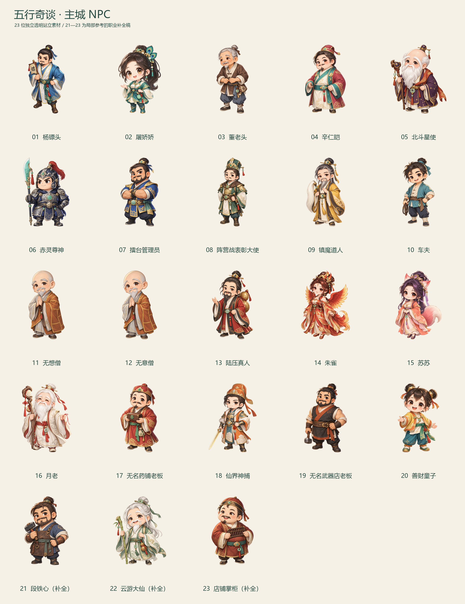

# 五行奇谈 · 主城 NPC

按 designs 已确认的道家 Q 版手绘风格完成 **20 位截图主体 NPC + 3 位职业补全 NPC**。人物均为独立全身透明 PNG，适合主城摆放，也可复用于静态属性展示。本批交付静态素材，尚未接入客户端。

[查看总览](overview.jpg) · [深底验收](qa-dark.jpg) · [下载完整素材包](city-npcs-transparent-23.zip) · [机器可读清单](manifest.json) · [验收记录](validation.json)



## 取用

- `transparent-1024/`：1024×1024 RGBA，适合运行时导入。
- `transparent-2048/`：2048×2048 RGBA，供较大的展示画布使用。
- `characters/`：01—20 的原生图、实际提示词和逐图生成记录。
- `supplemental/`：21—23 的原生图、提示词和记录，明确标记为职业补全设计。

全部原生图片均为 **1254×1254**。2048 导出采用等比重采样和透明留边，不代表原生 2K 细节。导出只去除 Alpha≤3 的近乎不可见像素，再等比放入统一画布；完整服装和道具保留，原生文件不变。画布底部锚点为 `(0.5, 0.12)`（左下为原点），依据可见轮廓底部定位；主城接入时仍按实际脚底位置确认枢轴。

主参考为 [结伴同游](references/style-team-ui-v2.png)。身份参考为用户8张截图，已保存在 `references/`。少量朱红结绳、流苏、羽饰和金玉装饰统一在明亮、圆润、温润手绘的画法中。

## 逐图索引

| 编号 | NPC | 透明导出 | 原生图 | 来源与提示词 |
|---|---|---|---|---|
| 01 | 杨镖头 | [2048](transparent-2048/01-yang-biaotou.png) · [1024](transparent-1024/01-yang-biaotou.png) | [原生](characters/01-yang-biaotou.png) | [生成记录](characters/01-yang-biaotou.png.generation.json) · [提示词](characters/01-yang-biaotou.prompt.txt) |
| 02 | 屠娇娇 | [2048](transparent-2048/02_tu-jiaojiao.png) · [1024](transparent-1024/02_tu-jiaojiao.png) | [原生](characters/02_tu-jiaojiao.png) | [生成记录](characters/02_tu-jiaojiao.png.generation.json) · [提示词](E:/work/image/designs/city-npcs-20260924/characters/02_tu-jiaojiao.png.prompt.txt) |
| 03 | 董老头 | [2048](transparent-2048/03_dong-laotou.png) · [1024](transparent-1024/03_dong-laotou.png) | [原生](characters/03_dong-laotou.png) | [生成记录](characters/03_dong-laotou.png.generation.json) · [提示词](E:/work/image/designs/city-npcs-20260924/characters/03_dong-laotou.png.prompt.txt) |
| 04 | 辛仁皑 | [2048](transparent-2048/04_xin-ren-ai.png) · [1024](transparent-1024/04_xin-ren-ai.png) | [原生](characters/04_xin-ren-ai.png) | [生成记录](characters/04_xin-ren-ai.png.generation.json) · [提示词](E:/work/image/designs/city-npcs-20260924/characters/04_xin-ren-ai.png.prompt.txt) |
| 05 | 北斗星使 | [2048](transparent-2048/05_beidou-xingshi.png) · [1024](transparent-1024/05_beidou-xingshi.png) | [原生](characters/05_beidou-xingshi.png) | [生成记录](characters/05_beidou-xingshi.png.generation.json) · [提示词](E:/work/image/designs/city-npcs-20260924/characters/05_beidou-xingshi.png.prompt.txt) |
| 06 | 赤灵尊神 | [2048](transparent-2048/06_chiling-zunshen.png) · [1024](transparent-1024/06_chiling-zunshen.png) | [原生](characters/06_chiling-zunshen.png) | [生成记录](characters/06_chiling-zunshen.png.generation.json) · [提示词](E:/work/image/designs/city-npcs-20260924/characters/06_chiling-zunshen.png.prompt.txt) |
| 07 | 擂台管理员 | [2048](transparent-2048/07_arena-manager.png) · [1024](transparent-1024/07_arena-manager.png) | [原生](characters/07_arena-manager.png) | [生成记录](characters/07_arena-manager.png.generation.json) · [提示词](E:/work/image/designs/city-npcs-20260924/characters/07_arena-manager.png.prompt.txt) |
| 08 | 阵营战表彰大使 | [2048](transparent-2048/08-faction-commendation-envoy.png) · [1024](transparent-1024/08-faction-commendation-envoy.png) | [原生](characters/08-faction-commendation-envoy.png) | [生成记录](characters/08-faction-commendation-envoy.png.generation.json) · [提示词](characters/08-faction-commendation-envoy.prompt.txt) |
| 09 | 镇魔道人 | [2048](transparent-2048/09-demon-quelling-taoist.png) · [1024](transparent-1024/09-demon-quelling-taoist.png) | [原生](characters/09-demon-quelling-taoist.png) | [生成记录](characters/09-demon-quelling-taoist.png.generation.json) · [提示词](characters/09-demon-quelling-taoist.prompt.txt) |
| 10 | 车夫 | [2048](transparent-2048/10-carter.png) · [1024](transparent-1024/10-carter.png) | [原生](characters/10-carter.png) | [生成记录](characters/10-carter.png.generation.json) · [提示词](characters/10-carter.prompt.txt) |
| 11 | 无想僧 | [2048](transparent-2048/11-wuxiang-monk.png) · [1024](transparent-1024/11-wuxiang-monk.png) | [原生](characters/11-wuxiang-monk.png) | [生成记录](characters/11-wuxiang-monk.png.generation.json) · [提示词](characters/11-wuxiang-monk.prompt.txt) |
| 12 | 无意僧 | [2048](transparent-2048/12-wuyi-monk.png) · [1024](transparent-1024/12-wuyi-monk.png) | [原生](characters/12-wuyi-monk.png) | [生成记录](characters/12-wuyi-monk.png.generation.json) · [提示词](characters/12-wuyi-monk.prompt.txt) |
| 13 | 陆压真人 | [2048](transparent-2048/13-luya-immortal.png) · [1024](transparent-1024/13-luya-immortal.png) | [原生](characters/13-luya-immortal.png) | [生成记录](characters/13-luya-immortal.png.generation.json) · [提示词](characters/13-luya-immortal.prompt.txt) |
| 14 | 朱雀 | [2048](transparent-2048/14-zhuque.png) · [1024](transparent-1024/14-zhuque.png) | [原生](characters/14-zhuque.png) | [生成记录](characters/14-zhuque.png.generation.json) · [提示词](characters/14-zhuque.prompt.txt) |
| 15 | 苏苏 | [2048](transparent-2048/15-susu.png) · [1024](transparent-1024/15-susu.png) | [原生](characters/15-susu.png) | [生成记录](characters/15-susu.png.generation.json) · [提示词](characters/15-susu.prompt.txt) |
| 16 | 月老 | [2048](transparent-2048/16-yue-lao.png) · [1024](transparent-1024/16-yue-lao.png) | [原生](characters/16-yue-lao.png) | [生成记录](characters/16-yue-lao.png.generation.json) · [提示词](characters/16-yue-lao.prompt.txt) |
| 17 | 无名药铺老板 | [2048](transparent-2048/17-medicine-shopkeeper.png) · [1024](transparent-1024/17-medicine-shopkeeper.png) | [原生](characters/17-medicine-shopkeeper.png) | [生成记录](characters/17-medicine-shopkeeper.png.generation.json) · [提示词](characters/17-medicine-shopkeeper.prompt.txt) |
| 18 | 仙界神捕 | [2048](transparent-2048/18-celestial-constable.png) · [1024](transparent-1024/18-celestial-constable.png) | [原生](characters/18-celestial-constable.png) | [生成记录](characters/18-celestial-constable.png.generation.json) · [提示词](characters/18-celestial-constable.prompt.txt) |
| 19 | 无名武器店老板 | [2048](transparent-2048/19-weapon-shopkeeper.png) · [1024](transparent-1024/19-weapon-shopkeeper.png) | [原生](characters/19-weapon-shopkeeper.png) | [生成记录](characters/19-weapon-shopkeeper.png.generation.json) · [提示词](characters/19-weapon-shopkeeper.prompt.txt) |
| 20 | 善财童子 | [2048](transparent-2048/20-shancai.png) · [1024](transparent-1024/20-shancai.png) | [原生](characters/20-shancai.png) | [生成记录](characters/20-shancai.png.generation.json) · [提示词](characters/20-shancai.prompt.txt) |
| 21 | 段铁心（补全） | [2048](transparent-2048/21_duan-tiexin-completion.png) · [1024](transparent-1024/21_duan-tiexin-completion.png) | [原生](supplemental/21_duan-tiexin-completion.png) | [生成记录](supplemental/21_duan-tiexin-completion.png.generation.json) · [提示词](E:/work/image/designs/city-npcs-20260924/supplemental/21_duan-tiexin-completion.png.prompt.txt) |
| 22 | 云游大仙（补全） | [2048](transparent-2048/22_yunyou-daxian-completion.png) · [1024](transparent-1024/22_yunyou-daxian-completion.png) | [原生](supplemental/22_yunyou-daxian-completion.png) | [生成记录](supplemental/22_yunyou-daxian-completion.png.generation.json) · [提示词](E:/work/image/designs/city-npcs-20260924/supplemental/22_yunyou-daxian-completion.png.prompt.txt) |
| 23 | 店铺掌柜（补全） | [2048](transparent-2048/23_shopkeeper-completion.png) · [1024](transparent-1024/23_shopkeeper-completion.png) | [原生](supplemental/23_shopkeeper-completion.png) | [生成记录](supplemental/23_shopkeeper-completion.png.generation.json) · [提示词](E:/work/image/designs/city-npcs-20260924/supplemental/23_shopkeeper-completion.png.prompt.txt) |

## 3 张职业补全稿

21 段铁心、22 云游大仙在截图中只露出名字和少量腿脚；根据锻造、云游职业语义补全了脸、服装和道具。23 店铺掌柜保留可见的红棕衣帽与圆胖体态，其正式 NPC 名称在截图中被截断，未补写未知姓名。这三张单独标为补全稿；不可见细节属于原创设计。

无想僧与无意僧按两位独立 NPC 制作，外形近似来自原参考设定。玩家、坐骑、称号与场景均未混入素材。

## 模型与生成记录

本批使用宿主内置 `image_gen`。官方已宣布 Images 2.5 向 Codex 开放；配置目标为 `gpt-image-2.5-sunburst / max`。工具未提供模型、质量或尺寸选择参数。PNG 的 C2PA 来源声明只报告 `softwareAgent = ChatGPT / gpt-image`，没有披露具体 2.5／2.0 版本或质量；记录中的 `actualModel` 仅保存这个系列名，`actualModelVersion`、`actualQuality` 为 `null`。未将配置、提示词或公告当作实际参数证明。

每张原生图有独立 `.generation.json` 和 `.provenance.json`，记录配置快照、实际提示词、输入参考、生成时间、哈希、返回字段与内嵌声明。C2PA 已解析，未验证数字签名。每张导出与总览有 `.derivation.json`，可追溯对应原生图。[官方核对与调用说明](model-check.md)。

两张未采用候选（屠娇娇长腿初稿、无意僧不透明初稿）连同独立记录保留在原生目录的 `candidates/`、`attempts/`，不在交付 PNG 或素材包内。

## 验收与复现

已核对全身完整性、角色辨识、浅深背景边缘、真实 Alpha、透明边距、逐图哈希和派生来源链。静态文件校验不代表已经完成战斗动画或主城引擎接入。

```powershell
python designs/city-npcs-20260924/tools/record_provenance.py
python designs/city-npcs-20260924/tools/build_delivery.py
python designs/city-npcs-20260924/tools/package_delivery.py
```

复现脚本只读取既有图片并整理导出，不调用图像模型。
