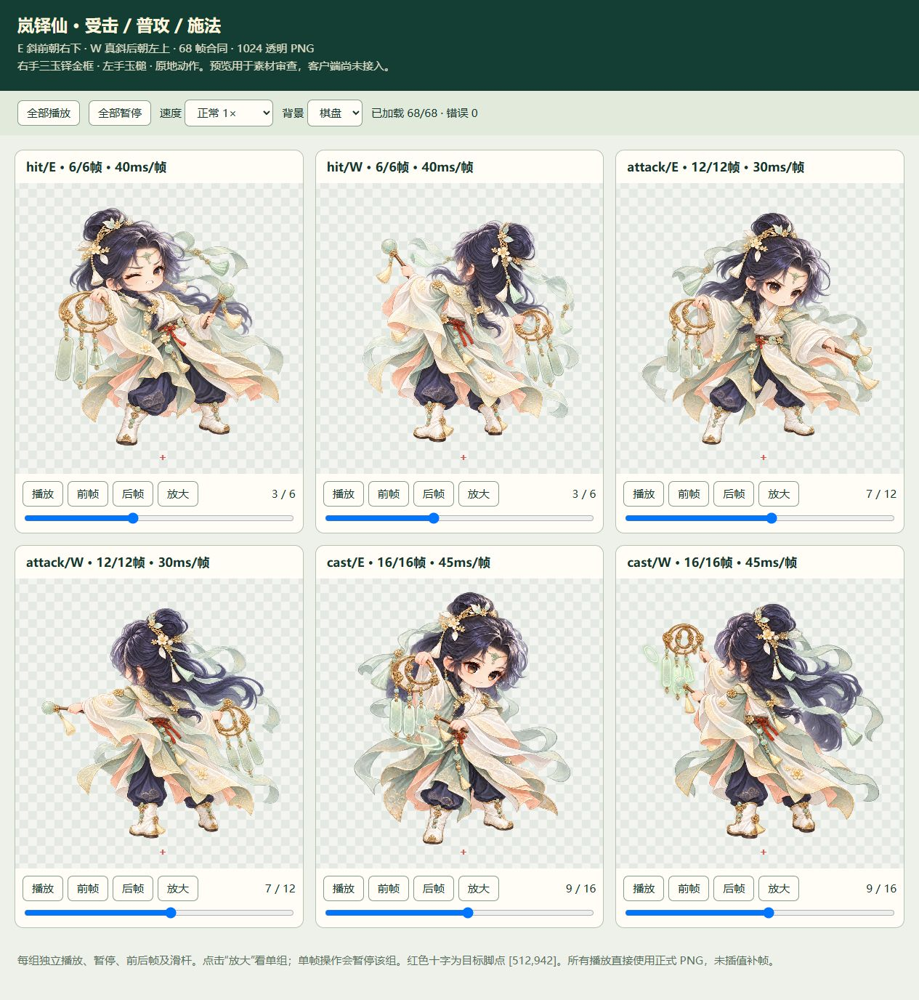

# 岚铎仙 · 战斗动作成品

2026-10-08 完成。沿用 Image 原有岚铎仙身份，交付受击、普攻、施法的 E/W 六组，共 **68 张 1024×1024 RGBA 透明 PNG**。

打开 [动画总预览](preview/index.html)，可切换正常速度、0.25 倍慢放、暂停、前后帧、滑杆和背景。HTML 与 runtime 保持本目录结构即可在浏览器打开；不依赖外部网络服务。六组均已完成静态和浏览器预览检查，客户端尚未接入。

|动作|每方向帧数|每帧时长|单次总时长|独立预览|
|---|---:|---:|---:|---|
|受击 hit|6|40 ms|240 ms|[E](preview/hit-E.html) · [W](preview/hit-W.html)|
|普攻 attack|12|30 ms|360 ms|[E](preview/attack-E.html) · [W](preview/attack-W.html)|
|施法 cast|16|45 ms|720 ms|[E](preview/cast-E.html) · [W](preview/cast-W.html)|

正式图片在 `runtime/{hit,attack,cast}/{E,W}/`，以 `01.png` 起顺序编号。E 是斜前朝右下；W 是独立绘制的真斜后朝左上。右手持三玉铎金框、左手持玉槌；无翼无尾，不包含走路或跑步。

- [接入交接](MERGE_HANDOFF.md)：目录、时间、pivot、事件帧和坐标约定。
- [动作清单](manifest.json)、[SHA256](SHA256SUMS.txt)、[技术检查](validation.json)。
- [视觉检查](visual-review.json)、[完成状态](STATUS.md)、[逐图来源索引](PROVENANCE_INDEX.md)、[来源检查](provenance-audit.json)。
- [姿态设计](POSES.md)、[清理记录](cleanup.json)。

本批采用宿主管理的内置 image_gen。配置目标为 GPT Image 2.5 Sunburst / max；工具没有型号和质量选择器，实际返回也未披露，逐图实际值均如实记为未确认。原始提示词、提交记录、回执、源图 SHA 和修订文字记录均保留。

依照项目保留规则，最终 PNG 与引用核对后已删除本目录内的原生图、拒稿、中间图和重复检查图片。当前 E/W 身份参考及风格参考位于其他目录，保持原样。清理后可从成品重新生成预览和清单，不能从文字记录恢复被删的原生像素。

画面保留逐帧手绘的衣褶、飘带和饰物细微差异。各组采用相同画布缩放及留边，不进行逐帧脚底重对齐；实际接入后的缩放、足点观感、状态切换和战斗时序仍须在客户端验证。

