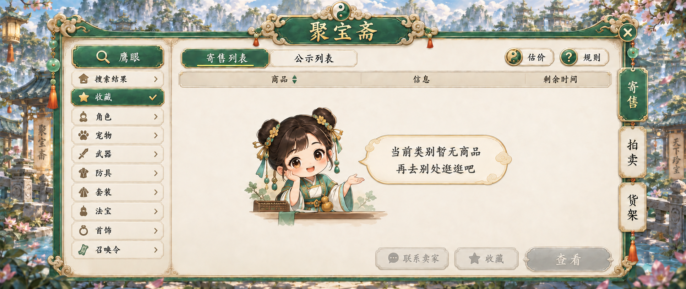
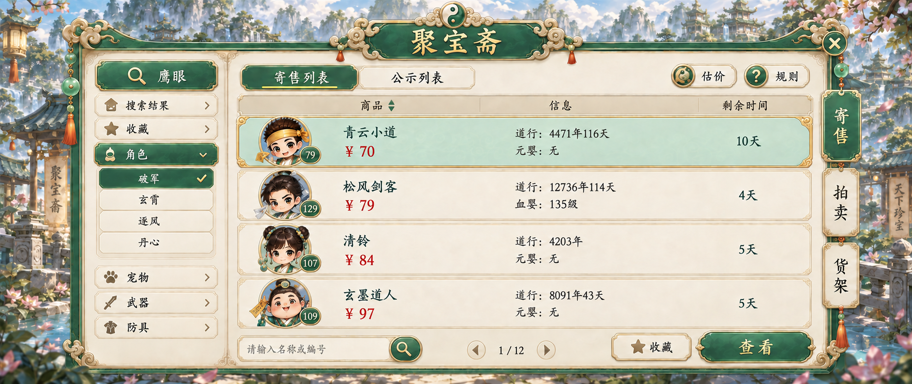
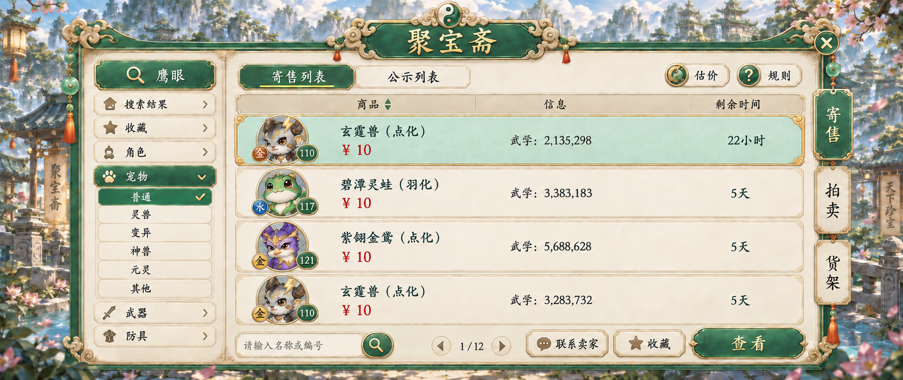
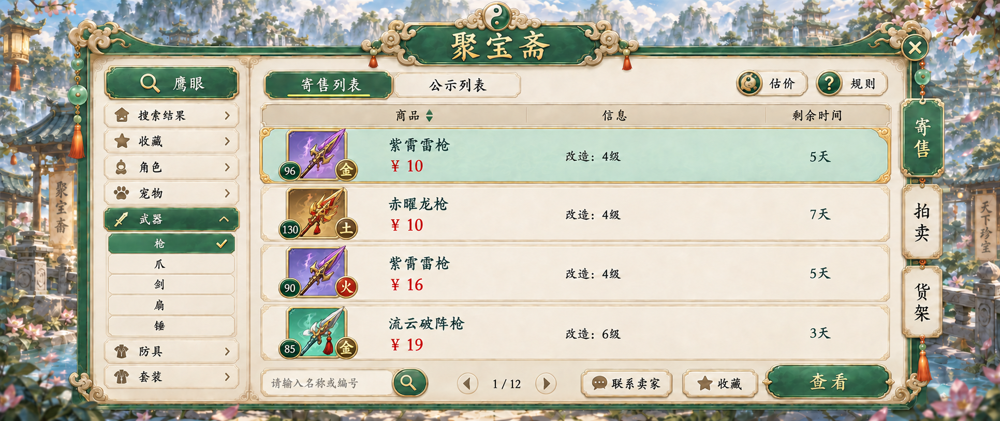
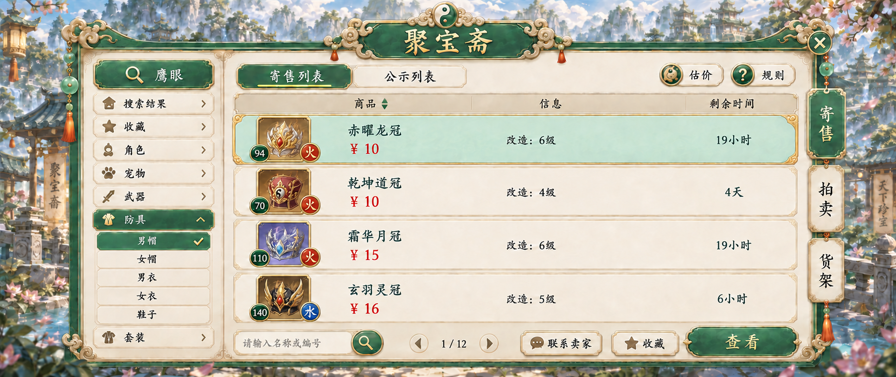
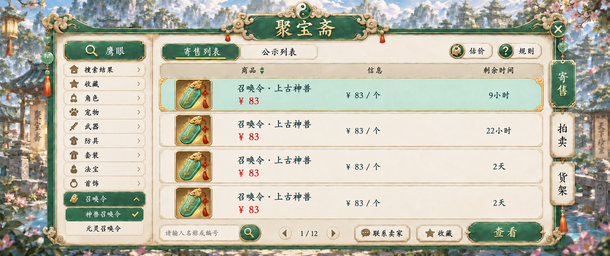
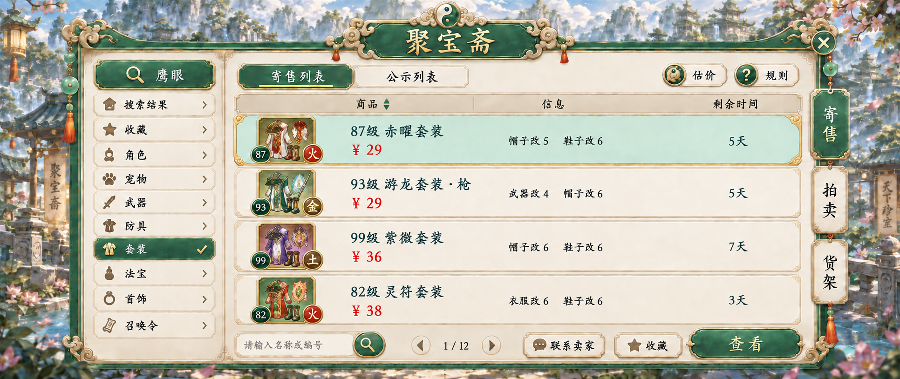

# 五行奇谈 · 聚宝斋 UI

2026-09-14：已通过Unity官方MCP完成36张独立Sprite切图并接入原生UGUI，6项模型断言和20张实际截图验收通过。[Unity切图、预览和验收](unity-slices/README.md)。入口为聚宝斋[U]；交易接口尚未接入。

2026-09-13：7 张最终静态效果图已完成，包含收藏空态、角色、宠物、武器、防具、召唤令和套装。全部使用项目指定的道家 Q 版手绘玉绿、象牙米白与细暖金边框，点缀太极、玉珠、短红穗与花灯。

本轮已落实最新修订：角色门派仅保留 **破军、玄霄、逐风、丹心**；全部最终页面删除“镜石、魂器”；宠物和装备采用新的名称。截图第 7、8 张哈希完全相同，因此合并为一张套装页。

## 最终原图

| 页面 | 原图 | 原生尺寸 |
| --- | --- | --- |
| 收藏空态 | [01-empty.png](01-empty.png) | 1932 × 814 |
| 角色寄售 | [02-characters.png](02-characters.png) | 1932 × 814 |
| 宠物寄售 | [03-pets.png](03-pets.png) | 1932 × 814 |
| 武器寄售 | [04-weapons.png](04-weapons.png) | 1932 × 814 |
| 防具寄售 | [05-armor.png](05-armor.png) | 1932 × 814 |
| 召唤令寄售 | [06-summoning.png](06-summoning.png) | 1933 × 814 |
| 套装寄售 | [07-sets.png](07-sets.png) | 1932 × 814 |

[最终文案](copy.zh-CN.json) · [生成及来源清单](manifest.json) · [核验记录](validation.json)

## 新名称

- 宠物：玄霆兽、碧潭灵蛙、紫翎金鸢；两条玄霆兽为同类不同数值的商品，保留点化／羽化标记。
- 武器：紫霄雷枪、赤曜龙枪、流云破阵枪。
- 防具：赤曜龙冠、乾坤道冠、霜华月冠、玄羽灵冠。
- 套装：赤曜套装、游龙套装·枪、紫微套装、灵符套装，保留等级前缀。

## 来源与用途

美术依据为[项目指定风格图](references/project-style.png)和[UI 制作规范第 2 节](../../qdao_ui_redesign_v5/UI_SPEC.md#2-统一视觉与控件层级)。用户的 8 张截图保存在 references/function-*.jpg，仅提供功能与信息结构。

全部使用宿主内置 image_gen，沿用项目 GPT Image 2 默认路径，以最高可用质量为目标。工具未开放 model、quality 开关，因此没有宣称显式强制 high。本地图片引用遇到 Windows ACL 初始化故障后，改用实际显示在对话中的风格图及同套母版生成。未调用独立付费 API。

原生输出直接保存，未进行放大或重采样。具体尺寸见表格，不宣称原生 2560 × 1080。初始提示词及本次修订提示词保存在 prompts/；最终修订实际使用的初稿保存在 source/*.initial.png，仅作来源，可能含旧分类和旧名称，**正式使用本目录根部七张 PNG**。

本轮交付为静态图，图中的公示列表、拍卖、货架、估价、规则保留入口，尚未制作对应子页、拆运行时切片或接入客户端。商品数据为展示样例；后续接入时采用 [copy.zh-CN.json](copy.zh-CN.json) 与真实业务数据绘制原生文字。

## 逐页预览

### 收藏空态

### 角色寄售

### 宠物寄售

### 武器寄售

### 防具寄售

### 召唤令寄售

### 套装寄售

