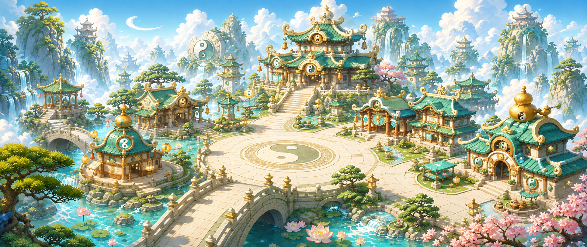
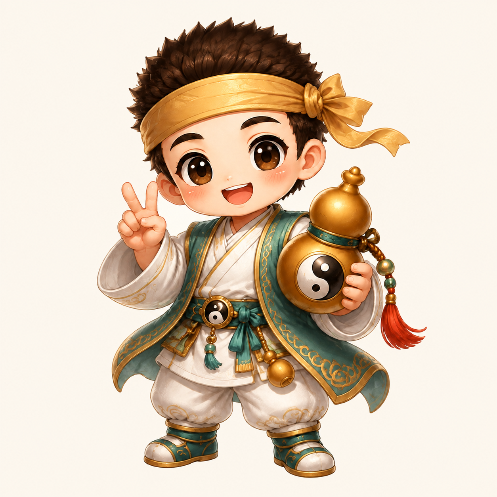

# 道家 Q 版主城与人物定调

2026-09-12：本轮[全库节庆精修](../qdao_festival_refinement_20260910/README.md)已完成；当前来源、透明导出与同源副本以该最终验收入口为准。下文早期尺寸与来源描述保留其历史日期，长期画法约束继续沿用。

## 需求与参考

2026-09-05：在现有道家主题上提升图片观感，制作主城地图画面，并把人物改得更 Q。以下两张既有图曾是风格基准；2026-09-06全库更新已在同路径导出新版兼容图，历史内容可在提交60134a6查阅：

- [战斗进入图](../qdao_battle_entry_loading_2560x1080_v2.png)：青绿云气、仙山瀑布、暖金光线、发带小道童。
- [登录图](../q_daoist_login_clear_lidazui_headband_2560x1080.png)：玉绿、米白、桃木、金色边饰，以及太极、葫芦和红穗元素。

2026-09-06：继续完善游戏素材交付，沿用上述定调制作 v4 标准宽屏背景、独立透明人物与排布预览。完整说明和重建命令见 [v4 素材包](../qdao_chibi_game_pack_v4/README.md)。

## 最新交付：素材包 v4

| 文件 | 交付规格 | 来源与用途 |
|---|---|---|
| [main-city_2560x1080.png](../qdao_chibi_game_pack_v4/main-city_2560x1080.png) | 2560 × 1080，PNG | 主城 v1 经等比 cover 适配和重采样后的标准背景 |
| [hero-transparent_1024.png](../qdao_chibi_game_pack_v4/hero-transparent_1024.png) | 1024 × 1024，RGBA PNG | 以人物 v3 为参考生成纯洋红底图，再经 `generate2dsprite` 清除背景和整理导出 |
| [preview-main-city_2560x1080.png](../qdao_chibi_game_pack_v4/preview-main-city_2560x1080.png) | 2560 × 1080，PNG | 透明人物放入主城广场的排布效果预览 |

主城标准版源自 1930 × 815 的既有图，**重采样后的尺寸不代表原生生成分辨率提升**。人物新来源图为原生 1254 × 1254 的 [hero-matte.png](../qdao_chibi_game_pack_v4/source/hero-matte.png)，保留 [生成提示词](../qdao_chibi_game_pack_v4/source/hero-matte.prompt.txt) 和 [处理记录](../qdao_chibi_game_pack_v4/source/hero-processing.json)。透明人物由真实 Alpha 通道表达背景透明度。

[素材清单](../qdao_chibi_game_pack_v4/manifest.json)、[排布记录](../qdao_chibi_game_pack_v4/placements.json) 和 [构建脚本](../qdao_chibi_game_pack_v4/build_pack.py) 随包提供。重建从保留的图像输入开始，使用本地处理器，不调用付费生图 API。

## 历史定调：主城 v1 与人物 v3

| 文件 | 原生尺寸 / 格式 | 用途 |
|---|---|---|
| `qdao_main_city_chibi_v1.png` | 1930 × 815，RGB PNG | 接近参考宽屏比例的主城场景定调图 |
| `q_daoist_hero_chibi_headband_v3.png` | 1254 × 1254，RGB PNG | 浅米色背景的完整单人物定调稿 |

两张定调图于 2026-09-05 使用 Codex 内置图像生成工具制作，原生输出尺寸如上。提示词中的 2560 × 1080 / 2048 × 2048 是期望尺寸，工具实际返回了不同尺寸。原文件保持原生尺寸，未覆盖；v4 的后处理导出另存于独立目录。

主城 v1：

人物 v3：

## 风格约束

2026-09-10 UI 补充：所有界面、控件、图标与切图先读 [UI 制作规范第 2 节](../qdao_ui_redesign_v5/UI_SPEC.md#2-统一视觉与控件层级)，其中统一维护指定风格图、功能参考规则、重切要求和通用提示词；本节场景与人物约束继续作为补充。

2026-09-09 新增后续定调：整体始终是道家 Q 版，在当前全部出图任务完成后，为全库图片适量融入春节、元宵、中秋氛围。具体元素、全库范围、监测顺序与验收以[节庆氛围全库精修](QDAO_FESTIVAL_REFINEMENT.md)为准；沿用最新完成的人物差异化、曝光修正和 UI 定调结果。

- 色彩：青绿和玉色为主，米白铺地、暖金勾边；桃花粉与红穗只作少量点缀。保留明亮日光和清晰层次。
- 建筑：圆润屋顶、短粗柱体、柔和翘檐、厚实石桥。中轴道观作为主要地标，太极广场留出呼吸空间，炼丹阁和街坊沿路排列。
- 山水：层叠仙山、瀑布、云海、松树和荷池；前景轮廓清楚，远景通过明度和空气感退后。
- 主角道童：保留短刺发、金色发带、玉绿外袍、米白内衫裤装、太极扣和金色葫芦。强调大头、圆脸、红润脸颊、短躯干和短四肢；避免改回写实少年比例。
- 职业人物：以[人物差异化v9](../qdao_character_diversity_v9/README.md)为当前定调。01–22采用独立脸型、年龄、直发/束发/辫发、体态与职业服装；共同保持道家Q版，避免同一主角脸与换色模板。具体外观原创，不复刻既有作品角色。
- 画法：清晰的高清手绘质感，轮廓和大色块优先，金饰细节适量；避免塑料玩具反光、写实皮肤和密集噪点。

## 生成记录与继续制作

1. **主城 v1**：使用两张风格基准图生成环境主城图，提示词见 [主城提示词](../qdao_main_city_chibi_v1.prompt.txt)。
2. **人物 v3**：沿用原图中的道童身份特征，并结合新主城配色制作人物，提示词见 [人物提示词](../q_daoist_hero_chibi_headband_v3.prompt.txt)。
3. **v3 背景修订**：人物首版把棋盘格画进了 RGB 图片，未作为透明资产验收。随后修订为浅米色背景，保留人物形象；修订指令记录在提示词文件中。因此，历史 v3 仍是 RGB 定调稿。
4. **历史原图归档**：生成结果复制到本仓库，保留工具原始输出。两张历史图均通过 PNG 完整性、尺寸及视觉检查。
5. **v4 游戏素材整理**：主城原图导出标准宽屏尺寸；以 v3 为参考重新生成纯洋红背景的单个人物，通过本地处理器取得 RGBA 透明素材，并生成广场排布预览。来源图、提示词和处理记录保存在 v4 目录。

## 使用范围与接入边界

当前主城仍是完整的平面场景背景，尚未拆分可交互建筑、遮挡层、可行走区域、碰撞或导航数据。v4本身增加独立透明人物；本轮后续已重制独立的[八方向移动素材](../character_move_8dir/README.md)，骨骼数据不在交付范围。排布预览用于检视比例和构图，不代表可操作地图。

本次未更改客户端资源引用，未接入 FairyGUI 或 Unity。后续接入应在明确的客户端任务中确定资源路径、锚点、排序层和缩放方式；制作可行走主城或角色动画时，再沿用当前定调补充地图数据、独立图层和动作素材。仓库中的旧资源接线脚本不作为本包重建入口。

继续安装工具见 [AI 设计工具安装与交接](AI_DESIGN_TOOLS_SETUP.md)。本次创作使用宿主已有的图像工具；安装记录中的外部图片 API 和 Figma MCP 仍待凭证或插件连接。本次文档更新不改变 9 个 Skills、4 个 MCP 的安装记录与启用状态。
