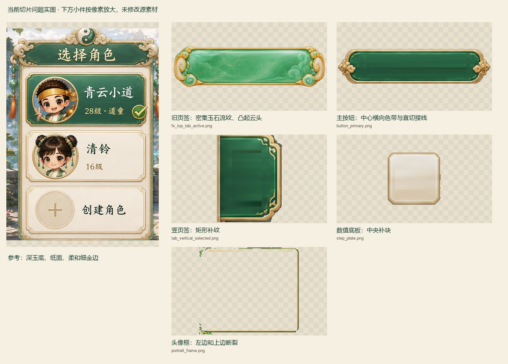

# 五行奇谈 · 当前版本全文件夹风格复核

> **后续补查已完成：**158份正式UI、124物件、32动作帧及本轮新增素材详见[最新补查结果](continuation/README.md)。下文保留07:35快照；v10“当时无图”的状态已由新报告更新。

**当前主要问题仍是旧 UI 造型/材质、新属性切片质量和版本混用。曝光修正已发布，不能沿用旧结论把全库继续判成“过亮”。**

依据 [2026-09-10指定风格图](../../docs/references/ui-style-20260910.png) 及 [UI规范第2节](../../qdao_ui_redesign_v5/UI_SPEC.md)：手绘深玉绿、象牙米白、温润暖金，纹理克制，圆润Q版；保留职业、年龄、体态与少量节庆差异。

## 当前确认的问题

| 优先级 | 位置 | 具体差异与处理方向 |
|---|---|---|
| 高 · 风格 | [exact旧页签](../../exact_qdao_slices/fx_top_tab_active.png)、[v7 UI母图](../../qdao_gpt_image2_refresh_v7/ui/source/ui-skins-native.png) | 厚云头、密集玉石流纹仍在；同一种胶囊主按钮被扩用为页签、列表和搜索框。先重做各用途无字母件，再同步派生切片。 |
| 高 · 切图 | [头像框](../../designs/attribute-panels/v2-painted/unity-slices/png/portrait_frame.png) | 左边大段缺失、顶边断续。**纠正上次“轻微角接残点”的低估**，应重切并重组验收。 |
| 高 · 切图 | [主按钮](../../designs/attribute-panels/v2-painted/unity-slices/png/button_primary.png)、[竖页签](../../designs/attribute-panels/v2-painted/unity-slices/png/tab_vertical_selected.png)、[数值底板](../../designs/attribute-panels/v2-painted/unity-slices/png/step_plate.png) | 仍有横向色带、矩形补纹和直切接线；外金边基本完整，问题在无字底纹。 |
| 高 · 风格 | [结算保存截图](../../client_ui_refresh_20260908/qa/11-result-native.png) | 大面积棕色木质底和硬金框，与纸面/玉绿标题体系不统一。这里只确认保存截图，未运行客户端。 |
| 中 · 版本 | [HUD标准导出](../../qdao_ui_redesign_v5/04_main_city_hud_2560x1080.png)、[HUD source图](../../qdao_ui_redesign_v5/source/04_main_city_hud.png) | 两张主城布局、月轮位置、按钮形态不同；先选定权威来源，再统一重建。 |
| 中 · 制作中源稿 | [v11墨鸢游侠](../../qdao_chibi_roster_v11/27_ink_kite_ranger/source/portrait_raw.png) | 身体较长、线条偏漫画感；保留窄脸、高马尾、墨灰玉青和轻瘦身份，收短躯干腿部，回到该批约2.2–2.8头身目标。此为尚在制作的源稿。 |

旧UI影响范围覆盖 `exact_qdao_slices`、v5组件/HUD、v7 UI派生、旧登录原子/分层、根目录兼容图及 `client_ui_refresh_20260908/prepared`。这些属于共享来源问题，不应按复制文件数量计算独立重画工作量。[逐问题路径与本次SHA](findings.json)。

## 本次更正与保留

- 旧报告 **1,471行仅对应1,455条唯一路径**，有16条重复记录；原先按行数宣称文件数不准确。本次按完整路径为主键。
- 这1,455条路径中，518条字节未变、937条已变，0缺失；937条当前内容都对应曝光处理的发布输出。09竹弓少女、17书法师还在曝光前替换了角色源图，已按新形象复看。
- 已修好的关闭按钮背景、标题透明底、宠物头像取景等，不重新列为待办。前三类有补纹的控件外边基本完整，但不代表切片整体通过。
- 当前人物和物件样张多数保持手绘家族；年龄、宽窄脸、职业色、宠物物种、地图俯视用途不是自动判错依据。狮鼓护卫的方脸矮壮符合本批设定；人物不要求全部变回同一道童。
- v10目录当时只有准备文档、合同和提示词，尚无本轮新图，不能据此认为旧UI问题已解决。本次只写复核文件，没有改原素材或客户端。

## 所有文件夹覆盖

下表统计截至 **2026-09-10 07:35:59 UTC** 的 **3,219条视觉文件路径**，包含源图、备份、暂存和诊断图。Git、依赖与两次审查自身输出排除。该数字是文件枚举规模，**不表示本次重新逐张目视了3,219张，也不表示全部需重画**。

| 文件夹 | 视觉路径数 | 当前比较结果/用途 |
|---|---:|---|
| `.agents` | 0 | 已遍历，无范围内图片。 |
| `.work` | 4 | 旧属性暂存稿仍用旧控件；作为历史稿，不作为新皮肤来源。 |
| `character_move_8dir` | 32 | 当前动作样张保持手持葫芦Q道童；本次未重验全部32帧边缘与运动连续性。 |
| `client_ui_refresh_20260908` | 257 | 旧派生UI与棕色结算窗需统一；QA图不代表实时客户端。 |
| `designs` | 58 | v2-painted更接近基准；头像框断边、三类补纹问题仍在。旧稿与新稿并存。 |
| `docs` | 1 | 指定风格原图，作为基准保留。审查输出已排除计数。 |
| `exact_qdao_slices` | 100 | 旧云头/玉石流纹家族，需从母件统一，不是重新裁同一旧母图。 |
| `movement_diagnostics` | 0 | 已遍历，无范围内图片。 |
| `q_daoist_character_pack_4096` | 114 | 09竹弓少女、17书法师新版本保留身份差异；不能要求所有角色同一张道童脸。 |
| `q_daoist_login_ui_10240_redraw_clear_final_layers` | 171 | 旧原子件和分层需跟随UI母件更新；其中物件图标另按物件用途判断。 |
| `q_daoist_login_ui_uncropped_highres_final_layers` | 9 | 重组画面仍体现同一旧控件家族；同步有效分层与兼容输出。 |
| `qdao_asset_refresh_v6` | 164 | 历史物件/处理来源；本次样张与现有物件体系连贯，洋红底是过程用途。 |
| `qdao_character_diversity_v9` | 65 | 人物差异化过程图；当前竹弓稿与正式角色版本相对应。 |
| `qdao_chibi_game_pack_v4` | 4 | 场景样张保持青绿仙山/玉瓦/Q人物；UI版本问题应由HUD输出统一。 |
| `qdao_chibi_pets_v1` | 6 | 幼鹤样张仍符合圆润幼宠画法，不以物种差异判错。 |
| `qdao_chibi_roster_v11` | 2 | 新目录，2张制作中源稿已补看；狮鼓护卫符合矮壮设定，墨鸢游侠建议收短比例。 |
| `qdao_exposure_refinement_v8` | 1757 | 备份、staged和复核产物，不是1757件独立重画任务；曝光修正已发布。 |
| `qdao_gpt_image2_refresh_v7` | 310 | UI母图仍为主要偏差来源；物件母图保持家族连贯；角色/场景/历史来源分别使用。 |
| `qdao_ui_redesign_v5` | 104 | 组件和HUD继承旧皮肤，且两版HUD不一致；宠物画法不与UI控件混判。 |
| `qdao_ui_style_recut_v10` | 0 | 已遍历，无范围内图片。目前仅准备文档、提示词和合同，不表示新UI已生成。 |
| `tianyong_city_6x6` | 41 | 整图比插画基准更俯视、灰重细碎，适合地图用途；整组判断，不逐块孤立判错。 |
| `unity-download-resume` | 0 | 已遍历，无范围内图片。 |
| `[root]` | 20 | 登录兼容图仍继承旧选服控件；人物/场景别名按真实来源管理。 |

## 证据与范围

- 本次全库按路径/SHA复核；初次扫描3,217条，最终扫描新增v11源稿2条，原3,217条无覆盖、无缺失。新增两张已直接看图。
- 新视觉复核包含22个当前样张、5个像素放大细节以及2张新增人物源稿；此外逐图看过指定参考、两版HUD、结算、两名已换人物及属性切片总览。重复样张不累计成独立图片。
- 其余历史视觉意见参照上次审查记录，仅当字节相同时继承；发生曝光变化的文件，哈希只能证明处理来源，不能自动当成风格验收。旧报告关于32帧边缘及物件光泽的扩展复核建议，本次未逐件重验，保留为待复核项，不统计为当前确定缺陷。
- 样张表：[第1页](folders-01.jpg) · [第2页](folders-02.jpg) · [第3页](folders-03.jpg)；[样张来源与SHA](visual-samples.json)。原尺寸接缝另见上方对比图。
- 数据：[变化摘要](delta-summary.json) · [3,217条基线与旧记录](delta.json) · [最终新增/覆盖核对](final-snapshot-check.json) · [具体问题清单](findings.json)。
- 这是有时间边界的文件快照。其他任务继续生成的新图，应按其新SHA另复核；不将这里的结论冒充后续出图或实时客户端验收。
