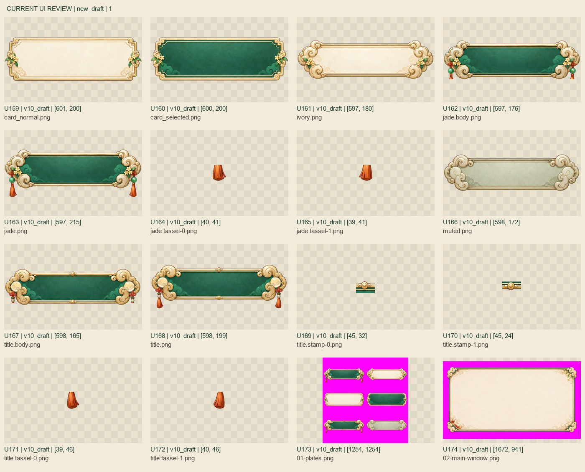

# 全文件夹风格补查 · 2026-09-10

**上次留下的逐件风格与边缘复核已补完。旧UI问题仍在；新v10原画方向已接近参考，但不能把新源稿算作旧切片已替换。**

本轮固定快照：2026-09-10 10:12:46 UTC，共 **3,245条视觉路径**；相对前次3,219条，新增26、修改0、缺失0。包含备份和过程图，排除Git/依赖/审查输出。对比仍依据[指定风格原图](../../../docs/references/ui-style-20260910.png)和[UI规范第2节](../../../qdao_ui_redesign_v5/UI_SPEC.md)。

## 本轮补完的范围

| 范围 | 实际视觉覆盖 | 结论 |
|---|---|---|
| 正式UI合同 | 158条PNG路径；相同解码像素关联后120个独立画面，8页全部实看 | 旧云头/玉石流纹仍需重制；属性切片的拼补和断边仍存在。 |
| v10新增源稿/试切 | 快照内17条，包含3张母图和14个试切/拆分件 | 深玉底、米白纸面、柔金边和少量桂花/流苏/月纹更接近参考。未替换正式158条资源。 |
| 正式物件 | 124枚全部看图；4张补做原尺寸抽查 | 主体画法同族，可保留；2张确认残边，见下表。 |
| 功能徽标 | 11条路径，10种不同画面 | 青翠颗粒玉底、厚亮金环需统一；leaf与peach_spirit是同SHA桃子别名。 |
| 正式动作 | 32帧全部轮廓＋每帧独立浅/深底发梢放大 | 原画风格可保留；每帧已分别确认品红细边。 |
| 正式宠物 | 4张全图＋各自局部边缘放大 | 风格可保留，只有低优先级细边清理；保留九尾狐正常淡紫毛。 |
| v11人物制作稿 | 8张源图，含4立绘、52个动作格 | 25/26/28基本匹配；27比例偏长，旧斜表有方向重复及切格风险。 |
| 天墉新增稿 | 2张地图风格稿＋1份参考副本 | 玉绿暖金stylematch稿更贴近基准；均未作为生产地图接入。 |

去掉跨组重复后，本轮有 **346条唯一图像路径**得到新的视觉记录。26条新增路径全部覆盖。收尾时7个v10试切件再次更新，也已补看并分别记录新SHA，见[最后版本对照](ui/end-changes.jpg)。正式UI的38个像素一致副本通过逐件像素哈希关联到已实看的代表图；没有用统计值代替风格判断。此前未变来源的审查仍见[上次报告](../README.md)。

## 仍需处理的具体位置

| 类别 | 位置 | 建议 |
|---|---|---|
| UI材质与造型 | 旧通用组件、exact、登录原子件/分层、HUD；10种功能徽标 | 用v10同风格母件继续重切同步，主按钮、列表、页签与输入框分别保持用途层级，不能只压暗旧图。 |
| 属性切片纹理 | `button_primary`、`title_plate`、`tab_horizontal`、`tab_vertical_normal/selected`、`step_plate` | 去字填补仍能辨认；修连续底纹后按原尺寸/拉伸尺寸重组检查。 |
| 属性框体 | `portrait_frame.png` | 左边缺失、上边断续，需完整重切。 |
| 动作边缘 | `character_move_8dir/` 32帧各自发梢 | 保留道童原画，定向清理已确认的品红边；每帧证据见[边缘索引](edges/README.md)。 |
| 物件边缘 | `17_han_zhongli_palm_leaf_fan.png`、`004_golden_cudgel.png` | 前者圆框/下方绿穗、后者圆框有洋红细边；[原尺寸证据](icons/native-checks.jpg)。不据此宣称全部124都有残边。 |
| 人物比例 | v11 `27_ink_kite_ranger` | 窄脸/高马尾/轻瘦身份保留；躯干腿部收短、减少硬切阴影，回到本批2.2–2.8头身目标。 |
| 动作源格 | v11 25的cardinal、27的旧diagonal | 主体接近/跨越等分行界，旧斜表前后斜向有重复；SW补表只解决对应方向输入，仍须检查最终整套方向与裁框。 |

棕色结算窗与两版主城HUD混用问题沿用前次实看结论；本轮其SHA未变化。保存截图仅证明文件内容，不代表当前客户端画面。新v10母件的body/tassel/stamp是拆分中间件，必须重新拼合验收，不能把单独碎片直接当作断边成品。

## 对照图与明细

- [正式UI 1](ui/formal_contract-01.jpg) · [2](ui/formal_contract-02.jpg) · [3](ui/formal_contract-03.jpg) · [4](ui/formal_contract-04.jpg) · [5](ui/formal_contract-05.jpg) · [6](ui/formal_contract-06.jpg) · [7](ui/formal_contract-07.jpg) · [8](ui/formal_contract-08.jpg)；[UI逐件记录](ui/review.json)。
- [物件/徽标逐件记录](icons/review.json) · [徽标原图对比](icons/badges-01.jpg) · [动作/宠物逐件记录](edges/review.json)。
- [v11人物与母表记录](review-roster.json) · [地图风格记录](review-maps.json)。
- [固定快照清单](snapshot.json) · [去重覆盖及结束SHA核验](coverage.json)。

本轮只修改审查目录中的报告与分析图，没有清理/重画原素材，也没有替换客户端。此次已完成的是固定快照内的风格比较与列明的局部边缘检查；不是全部图片逐像素合格、动画播放验收或生产资源修复完成。快照之后另一个制作任务的新输出需用新SHA另行验收。
