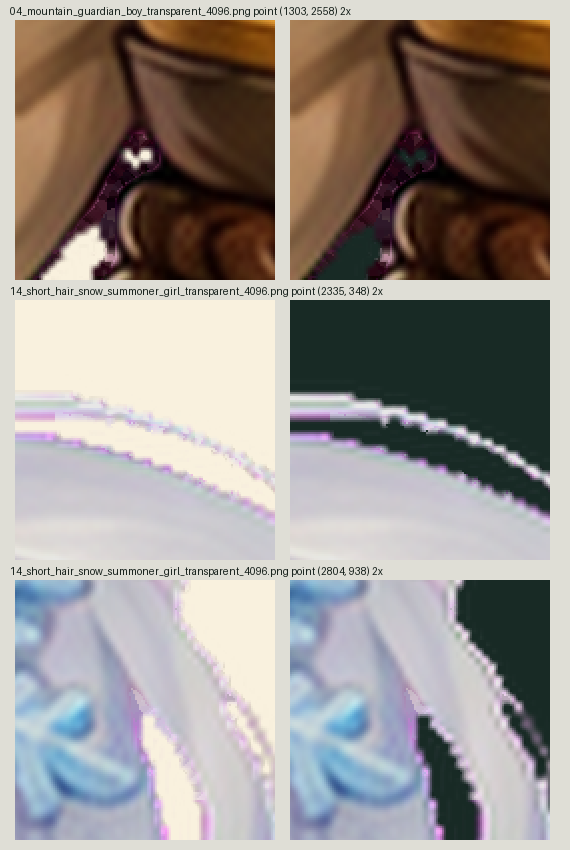

# 最新有限复核

> 后续修复已完成并发布：见 [第二轮发布记录](../../../qdao_cutout_edge_repair_20260911/v9/published.json)。下文与配图保留为修复前发现记录。

- 38 张前次发布源图 SHA 全部匹配；后续 UI 元数据明确排除，不构成图片回退。
- v9 04、14 当前文件与原制作方 final_edge_cleanup.json 的发布 SHA 一致，原定修复已写回。
- 但 2× 浅深底复核仍看到局部低饱和紫边：04 内侧甲缝暗紫点；14 银白发外缘细粉紫线。旧脚本强色候选为零不能代替视觉通过。建议仅在既有明确区域再做 RGB 去污染并保留全部 Alpha，不整图降阈值。
- 本复核只读源文件，未修改任何正式素材。

证据：`source-38-hash-review.json` 与 `v9-04-14-record-check.json`。
