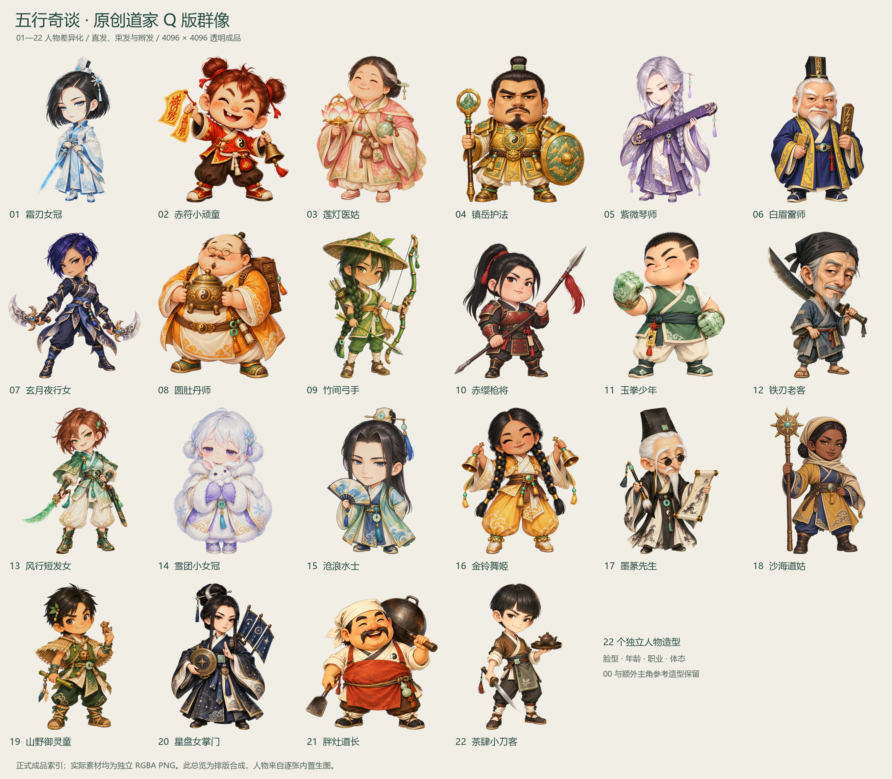

# 五行奇谈 · 人物差异化 v9

2026-09-11，01–22 号职业人物逐人原创重设计，保留原文件名和 4096×4096 RGBA 画布。以脸型、年龄感、直发造型、胖瘦体态、服装轮廓和职业法器区分人物。两张金发带主角参考保留既定造型，并沿用已验收的曝光修正。

[人物总览](roster_overview.png) · [逐图清单](manifest.json) · [原路径兼容映射](compatibility_map.json) · [最终校验](validation.json) · [逐图视觉验收](visual_qa.json)



## 造型与制作

全部采用直发，可剪短、束发、盘髻或编辫，不采用卷发。仙侠群像仅提供洒脱、清灵、英气、灵动等广义气质；脸型、服装结构、配色组合和法器独立设计，未使用既有作品角色图片作为人物外观模板。正式名称见[设计说明](DESIGN_BRIEF.md)和清单，旧英文文件名仅作为兼容资源 ID。

每个人物使用宿主内置 GPT Image 2 路径独立生成，按 imagegen 与 generate2dsprite 技能处理。本次工具没有模型、质量开关，high 是质量目标；实际原生图均为 1254×1254，4096 为保持原规格的重采样导出，不代表原生 4K。完整实际提示词在[人物包 prompts](../q_daoist_character_pack_4096/prompts)，原生尺寸、来源标识和后处理记录在[records](../q_daoist_character_pack_4096/records)。

此前已发布的 v8 曝光修正覆盖本轮先完成的 13 个职业人物和两张主角参考。本轮核对了修正前后哈希及 Alpha 一致性，保留现图并记录[继承来源](inherited_refinements.json)，未将它们回退至旧生成版本。

最终又对04、14两张图的已确认局部品红边进行RGB去色边，严格保持所有Alpha和区域外像素。处理范围、像素数和前后哈希见[局部修复记录](final_edge_cleanup.json)；该记录接在曝光修正之后，当前图片不会被误判为旧曝光输出。

## 验收与清理

验收检查 24 个旧路径与尺寸、RGBA 和透明边距、22 个重绘哈希、2 个主角参考、完整来源链及当前图片对应的视觉记录。人物在浅色、深色背景和局部放大图中检查过头发、完整手脚、法器与轮廓；胖灶道长额外修正了大头短身比例。

[清理记录](cleanup.json)登记本轮 `.work` 过程母图、处理副本、临时 GIF 和暂存输出。正式人物、这张交付总览、提示词、脚本与验收 JSON 保留。其他任务的图片、备份及正在制作的内容不在本轮清理范围。

```powershell
python -B qdao_character_diversity_v9/build_manifest.py
python -B qdao_character_diversity_v9/build_overview.py
```

旧入口 `q_daoist_character_pack_4096/build_manifest.py` 转发到当前验证器，防止重写回 v6 清单。验证器绑定视觉验收的图片哈希；换图后必须重新实看，不能沿用旧验收。

本轮交付静态人物美术，未将这些人物接入游戏，也未制作它们的新动作。主角动作、宠物、UI 及 v11 新增 23–28 号人物的进度由对应任务记录。

## 1024 人物导入副本补齐

2026-09-11 继续盘点时发现仓库内 22 张导入副本仍为旧人物，现已全部同步为本轮原创直发 Q 版人物，保留 `client_ui_refresh_20260908/prepared/UI/qdao_v3/characters/` 的原路径和 1024×1024 RGBA 画布。[同步记录](prepared_sync.json)逐图保存新旧哈希、来源与透明范围；只读检查确认全部与当前 4096 母图的 LANCZOS 降采样逐像素一致。

本次只更新美术仓库内准备资源，未访问实际客户端或 `.meta`。客户端清单中的 22 条人物记录标为 `pending_client_sync`，历史客户端哈希继续保留，不把旧同步记录当作本轮接入通过。

```powershell
python -B qdao_character_diversity_v9/sync_prepared.py --check
```
