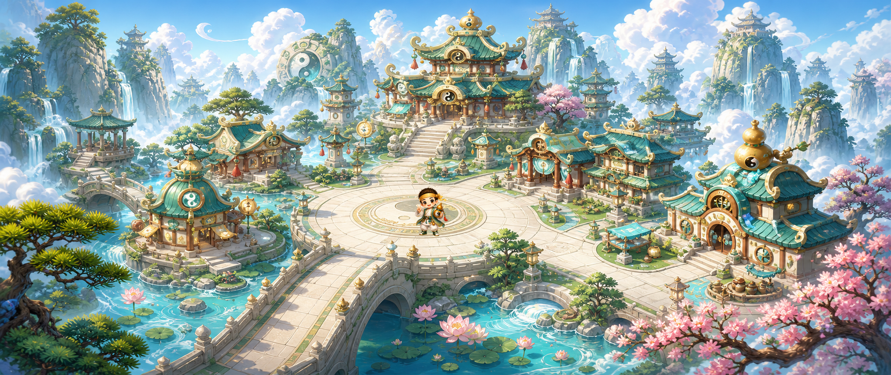

# 道家 Q 版游戏素材包 v4

日期：2026-09-06。本包沿用 [主城 v1](../qdao_main_city_chibi_v1.png) 与 [人物 v3](../q_daoist_hero_chibi_headband_v3.png) 的美术定调，提供标准宽屏背景、独立透明人物和人物在场景中的排布预览。原图保留在仓库根目录。

## 素材与来源

| 文件 | 交付规格 | 用途及来源 |
|---|---|---|
| [main-city_2560x1080.png](main-city_2560x1080.png) | 2560 × 1080，PNG | 主城 v1 的标准宽屏导出；将 1930 × 815 原图等比 cover 适配并重采样 |
| [hero-transparent_1024.png](hero-transparent_1024.png) | 1024 × 1024，RGBA PNG | 单个人物透明素材；以人物 v3 为参考重新生成洋红底原图，再清除背景、对齐并导出 |
| [preview-main-city_2560x1080.png](preview-main-city_2560x1080.png) | 2560 × 1080，PNG | 人物放入主城广场的排布效果预览 |
| [manifest.json](manifest.json) | 素材清单 | 记录本包导出文件与制作信息，以实际内容为准 |
| [placements.json](placements.json) | 排布记录 | 记录合成预览中人物的放置方式，以实际内容为准 |
| [build_pack.py](build_pack.py) | Python 构建脚本 | 从保留的原图和本地处理器重建输出 |

**主城标准版经过重采样，2560 × 1080 不是新的原生生成分辨率。** cover 适配保持比例，使画面覆盖目标画布，再裁切超出部分；不拉伸建筑和场景。旧版 1930 × 815 原图保持不变。

透明人物的创作原图为 [source/hero-matte.png](source/hero-matte.png)，图像工具原生输出 1254 × 1254，采用纯洋红背景。它以 v3 人物为形象参考重新生成，随后使用已安装的 `generate2dsprite` 处理器制作真正的 RGBA 透明输出。1024 × 1024 是处理后的交付尺寸。

## 查看效果



独立人物：


预览图已经把人物合成到背景中。接入时分别使用主城背景和透明人物，按目标显示尺寸调整排布；透明区域以 PNG 的 Alpha 通道为准。

## 生成记录与本地重建

- [人物生成提示词](source/hero-matte.prompt.txt)：记录从 v3 参考图生成洋红底人物的指令。
- [人物处理记录](source/hero-processing.json)：记录透明化与后处理过程，具体参数和结果以文件内容为准。
- [美术定调](../docs/QDAO_ART_DIRECTION.md)：记录色彩、建筑、山水、人物比例，以及 v1/v3 的生成历史。

在其他电脑上重建前，按 [工具安装说明](../docs/AI_DESIGN_TOOLS_SETUP.md)准备 Python、Pillow、NumPy 和 `generate2dsprite` Skill。保留整个本包目录及仓库根目录的 `qdao_main_city_chibi_v1.png`；处理器路径替换为当前用户实际安装目录。

在本目录执行：

```sh
python build_pack.py --processor "<SKILLS>/generate2dsprite/scripts/generate2dsprite.py"
```

`<SKILLS>` 默认是当前用户主目录下的 `.agents/skills`。macOS/Linux 可以使用 `python3`；Windows PowerShell 示例：

```powershell
$skillRoot = Join-Path ([Environment]::GetFolderPath('UserProfile')) '.agents/skills'
python build_pack.py --processor "$skillRoot/generate2dsprite/scripts/generate2dsprite.py"
```

重建使用已经保留的图像输入，调用本地处理器完成导出和预览合成，不调用付费生图 API。脚本参数和输出记录以 [build_pack.py](build_pack.py) 为准。若修改人物形象或场景内容，需要另行制作并保存新版本的来源图和提示词。

## 使用范围与后续工作

本包是平面背景加单张透明人物。人物没有动作帧、方向帧或骨骼数据；主城没有独立建筑层、前景遮挡、可行走区域、碰撞或导航数据。合成预览用于查看比例与画面关系，不代表可操作游戏场景。

本次未接入 FairyGUI、Unity 或其他客户端，也不依赖执行仓库中的旧资源接线脚本。接入应由明确的客户端任务确定资源引用、锚点、排序层和缩放规则；需要行走或交互时，再以当前定调制作动作与地图数据。

## 版本沿革

- **2026-09-05 / 主城 v1**：1930 × 815 的完整场景定调图，保留 [原图](../qdao_main_city_chibi_v1.png) 与 [提示词](../qdao_main_city_chibi_v1.prompt.txt)。
- **2026-09-05 / 人物 v3**：1254 × 1254、浅米色背景的 RGB 人物定调稿，保留 [原图](../q_daoist_hero_chibi_headband_v3.png) 与 [提示词及修订](../q_daoist_hero_chibi_headband_v3.prompt.txt)。
- **2026-09-06 / 素材包 v4**：基于上述定调制作标准背景导出、透明人物和排布预览，并保留来源、处理记录与本地重建脚本。

## 本次验收

三张交付 PNG 均通过完整性和尺寸检查。人物为 RGBA，Alpha 范围 0–255；轮廓完整且未触边，严格处理检查通过，检测到的高不透明度洋红残色为 0 像素。另已在深浅底色下检查边缘，并把场景预览中的脚点放在广场内部。文件 SHA-256 记录在 `manifest.json`。
