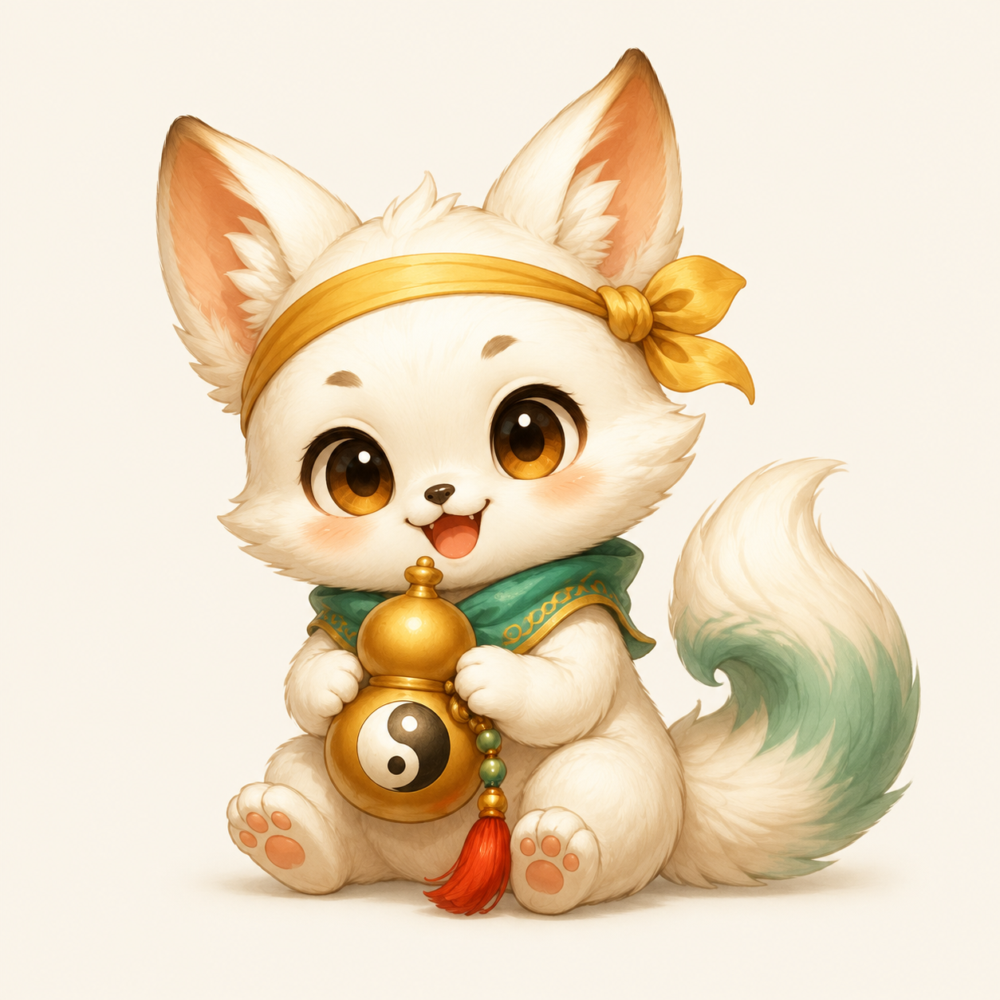
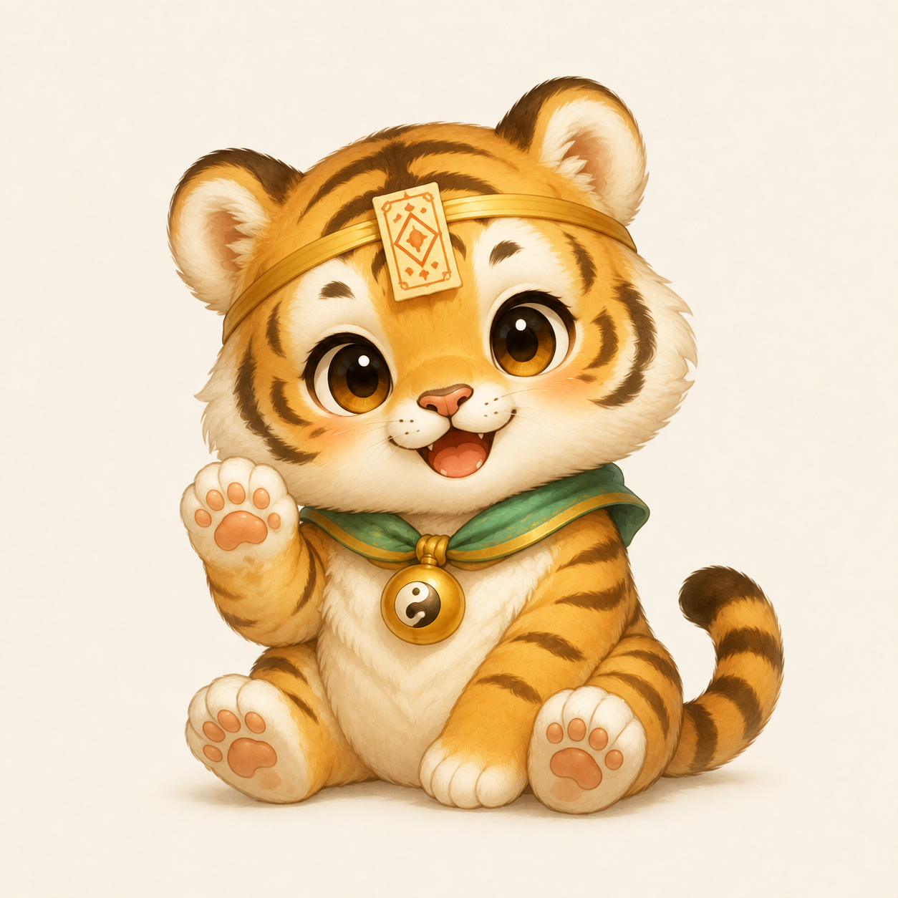
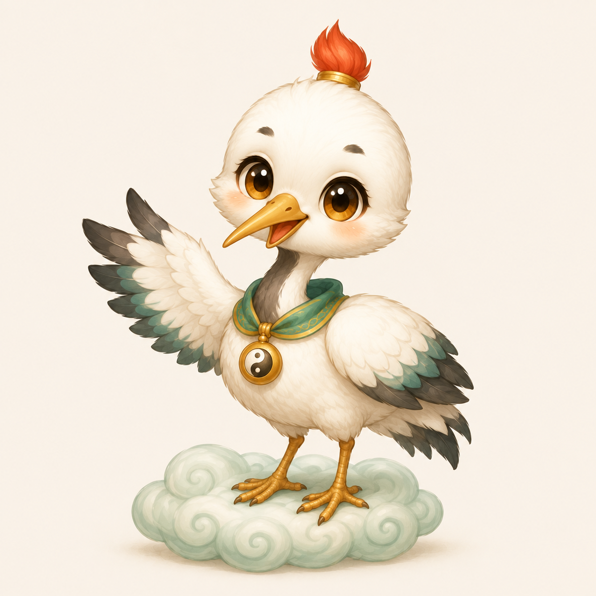

# 道家 Q 版宠物 · 第一组

2026-09-06，共三只原创宠物。沿用主城和发带小道童的青绿、米白、暖金手绘风格；每只采用不同动物轮廓与道家饰物，名字独立记录，未烘焙在图片中。

| 名字 | 类型 | 识别特征 | 图片与提示词 |
|---|---|---|---|
| **葫团团** | 葫芦灵狐 | 雪白软毛、金色发带、青绿尾尖，抱着太极葫芦 | [图片](01_hu_tuan_tuan.png) · [提示词](01_hu_tuan_tuan.prompt.txt) |
| **符小虎** | 符箓虎崽 | 杏金虎纹、额前小符箓、太极铃铛，举爪打招呼 | [图片](02_fu_xiao_hu.png) · [提示词](02_fu_xiao_hu.prompt.txt) |
| **云啾啾** | 云游小仙鹤 | 白羽红冠、青绿翼尖、祥云脚垫，展开小翅膀 | [图片](03_yun_jiu_jiu.png) · [提示词](03_yun_jiu_jiu.prompt.txt) |

## 图片

### 葫团团

### 符小虎

### 云啾啾

## 制作与继续使用

本组使用 Codex 内置图像工具生成。三张均为工具原生输出的 1254 × 1254 RGB PNG，浅米色背景，完整单宠物立绘，文件未做放大。图片完整性、尺寸和视觉检查已完成，校验值见 [manifest.json](manifest.json)。

基础风格参考为 [主城](../qdao_main_city_chibi_v1.png) 和 [发带小道童](../q_daoist_hero_chibi_headband_v3.png)。后两只同时参考前面已经完成的宠物，以统一眼睛、毛羽、金饰和背景的表现。

继续迭代时先查看对应宠物图片，再读取同名 `.prompt.txt`，保持名字、动物种类和上述识别特征一致。当前这组是带底色的静态立绘；需要透明精灵时，参考 [v4 人物素材包](../qdao_chibi_game_pack_v4/README.md) 的生成与透明化流程，单独交付 Alpha PNG。
