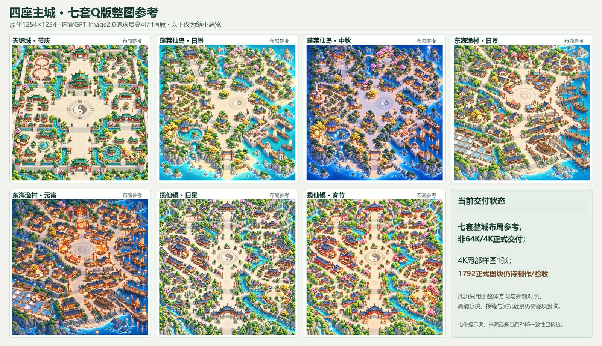

# 四座主城 · 七套Q版整图参考

七套完整地图的Q版风格/布局参考已经实际生成，均为原生1254×1254 PNG。它们用于覆盖所有主城和外观、统一后续分区造型与配色，**不是65536×65536成品，也不是4096×4096正式图块**。

全部使用用户指定的内置GPT Image2.0路线，提示词均要求最高可用画质。本轮七张图片的生成动作元数据均标注gpt-image 2.0；内置工具没有开放质量或型号选择器，未声称显式设置了max参数。没有调用单独计费API。

| 主城 | 外观 | 完整参考 |
|---|---|---|
| 天墉城 | 节庆 | [原生PNG](tianyong_festival/map-native-layout-reference.png) |
| 蓬莱仙岛 | 日景 | [原生PNG](penglai_day/map-native-layout-reference.png) |
| 蓬莱仙岛 | 中秋夜景 | [原生PNG](penglai_mid_autumn/map-native-layout-reference.png) |
| 东海渔村 | 日景 | [原生PNG](donghai_day/map-native-layout-reference.png) |
| 东海渔村 | 元宵夜景 | [原生PNG](donghai_lantern/map-native-layout-reference.png) |
| 揽仙镇 | 日景 | [原生PNG](lanxian_day/map-native-layout-reference.png) |
| 揽仙镇 | 春节 | [原生PNG](lanxian_spring/map-native-layout-reference.png) |

每个目录保存完整手写map.prompt.txt、实际传入的布局/画法JPEG、原生PNG和map.record.json。七张PNG均与内置工具原始输出字节一致，未放大。具体模型元数据见[七图读取审计](model-audit.json)，该读取没有进行密码学验签。主城覆盖依据见[客户端范围核对](city-coverage-audit.md)。

[七套地图高清总览](overview-all-seven.png) · [来源核验清单](overview-manifest.json)

## 视觉检查范围

各生成者对照原城图查看了主建筑、路网、广场、桥梁、水岸、南北出入口和地域色；日景和夜景分别保持原有光照主题。叶簇、屋瓦、岩面、微型饰物、帆索渔网与灯光形状存在重绘差异，因此不声称像素级布局不变或导航/前景已验收。

## 高清分块仍待完成

整城64K目标不变：每套16×16、256张4096²正式图块，七套合计1792张。当前只有[天墉r10_c07的4K局部样图](../builtin_q64_r10_c07/output/tianyong_r10_c07_q64_4k_candidate.png)完成生成及局部接缝检查；完整64K主城、其余正式图块、前景和实机验收尚未完成，客户端尚未替换。

[七套完整坐标计划](../q64_production_plans/README.md)已经建好，明确了世界坐标、图像坐标和日景/节庆运行时键。计划不是已生成数量，也不是可直接发布的客户端manifest。禁止把这里的1254²参考放大切成1792块后当作高清成品。