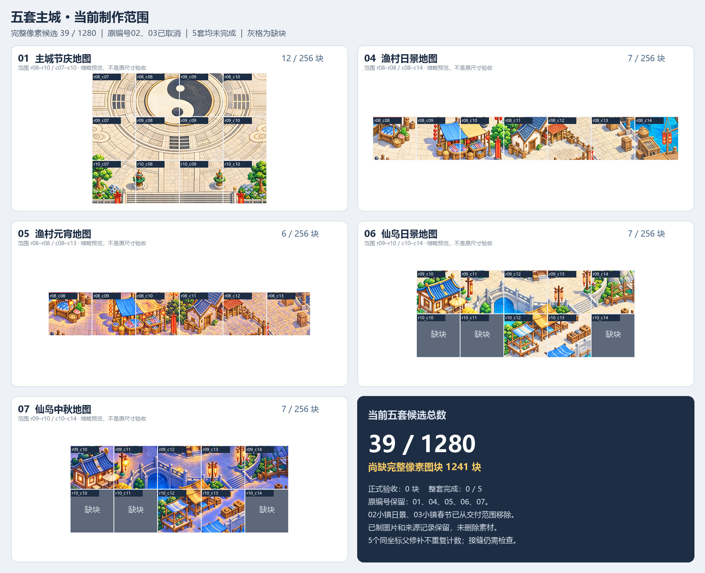

# 五套主城当前候选汇总

**当前39/1280块完整像素候选，尚缺1241块。正式验收0块，整套完成0/5。**

用户于2026-10-08明确要求“02、03 都取消”“取消吧”。当前仅制作与交付原编号01/04/05/06/07；02小镇日景与03小镇春节已移出范围，已有图片及来源证据保留。最新范围以[权威范围文件](../production-scope.json)为准，旧七套文档不再授权继续两套小镇。

| 套图 | 完整像素候选 | 尚缺/256 | 正式验收 |
|---|---:|---:|---:|
| 01 主城节庆地图 | 12 | 244 | 0 |
| 04 渔村日景地图 | 7 | 249 | 0 |
| 05 渔村元宵地图 | 6 | 250 | 0 |
| 06 仙岛日景地图 | 7 | 249 | 0 |
| 07 仙岛中秋地图 | 7 | 249 | 0 |

[统一索引](verified-current-index.json) · [范围变更校验](scope-cancellation-validation.json) · [五处同坐标父修补](parent-repair-current-overlay-v3.json)

总数仅从已核验53块快照移除两套各7块，未加入任何未审计新图。当前39块的选择、图像来源哈希、局部QA限制以及五处父修补保持不变；缩略图只用于查看区域布局，不表示完整地图或原尺寸验收。

渔村元宵日景铺地几何同步仍待完成；仙岛中秋r09_c14西侧树叶接缝尚未通过，北/东/南缺邻图。其他已记录的接缝、整城、寻路和客户端限制继续有效。

[取消前53块历史索引](historical-seven-appearances-53-before-cancellation.json)仅留作证据，不是当前交付清单。[取消任务的线程状态回执](../town-cancellation-thread-receipt-20261008.json)由父任务另行记录，本次范围编辑没有发送任务消息。
