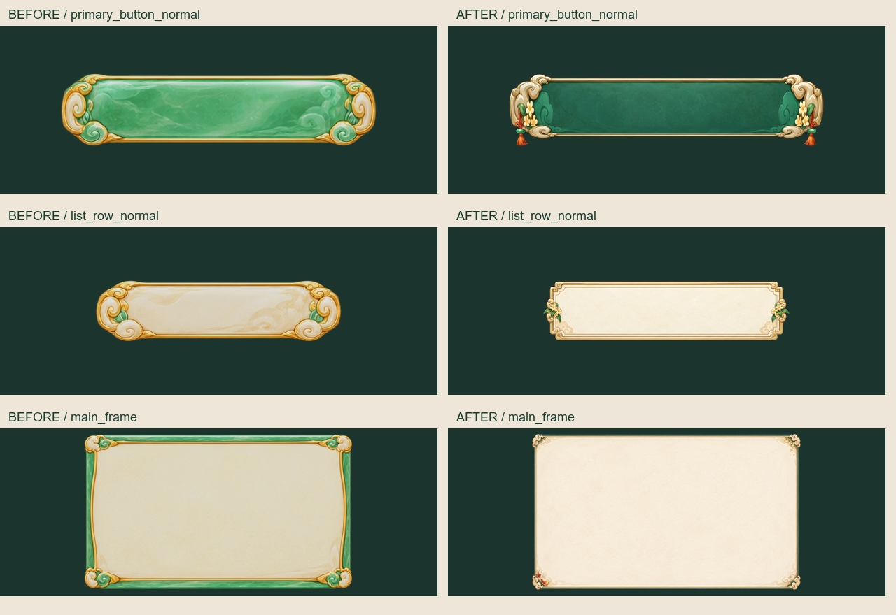

# 全文件夹对比后的切片修复交付

2026-09-11：本轮 UI、移动帧、宠物及道具切片修复已写入原正式目录，并完成发布后核验。试修图和备份只用于追溯，导入时继续使用原资源路径。

| 交付范围 | 实际完成 |
|---|---|
| UI | 158 张合同 PNG 与 126 个配套文件全部匹配验收版本。155 张为新版图像，2 张静态书法和 1 张独立 HUD 文字保留。 |
| 移动人物 | 32 帧逐张清理发梢残色；画布、全部 Alpha、头部以下像素与脚点保持不变。 |
| 宠物和道具 | 4 只宠物、2 件道具清边；正常紫色狐毛、红穗和金饰保留。 |
| 头像和副本 | 4 个头像及 10 个引用副本同步；灵玥头像粉紫候选 74 → 0，头像 Alpha 与裁切不变。 |
| 道具图集 | 按原坐标同步 124 格，每格与当前正式单图逐像素一致。 |

UI 材质按指定参考统一为深玉绿、米白纸面和柔金细边，保留道家 Q 版及少量桂花、流苏、月纹装饰。已修复头像框缺边及旧底纹拼补问题。

发布记录与备份索引：[UI](published-ui.json)、[人物](published-hero.json)、[宠物道具及副本](published-support.json)。最终逐文件检查见 [final-verification.json](final-verification.json)。所有替换均先检查当前与暂存 SHA，再备份、替换及复核；旧生成来源和历史清边记录保留。

人物存在少量低透明离散算法候选点，最高 Alpha 30/255；验收时无连续可见品红描边，不宣称数学上每个紫红像素都消失。过程图中的初版修复不是最终交付，以发布记录里的输出 SHA 为准。

## 后续素材复核与修复

- 25 号人物旧跨格源表已被制作任务排除，新正式 16 帧通过限定复核。
- 27 号墨鸢的旧比例与斜向动作问题已在后续批次修复，新的立绘、32 帧、8 条带、8 GIF 和 2 张图集已验收并写回原目录，见 [后续修复交付](../qdao_cutout_edge_repair_20260911/README.md)。
- 新到的 v9 人物中，04/14 的细边已在后续批次清理，4096 原图与仓库内 1024 副本均已同步；原 Alpha 与正常紫色装饰保留，见 [发布记录](../qdao_cutout_edge_repair_20260911/v9/published.json)。
- 棕色结算图是历史 Unity 截图，本仓库未包含该运行视图定义。本轮未向客户端工程复制文件，也未把历史截图当成实机验收。

限定复核证据见 [nonproduction-followup.json](../docs/style-repair-20260911/nonproduction-followup.json)。全文件夹比较的固定快照与逐件记录见 [原审计](../docs/style-audit-20260910/continuation/README.md)。本交付补齐的是其中已确认的正式 UI 与切片问题，不把后续新增制作稿混算为已完成。
