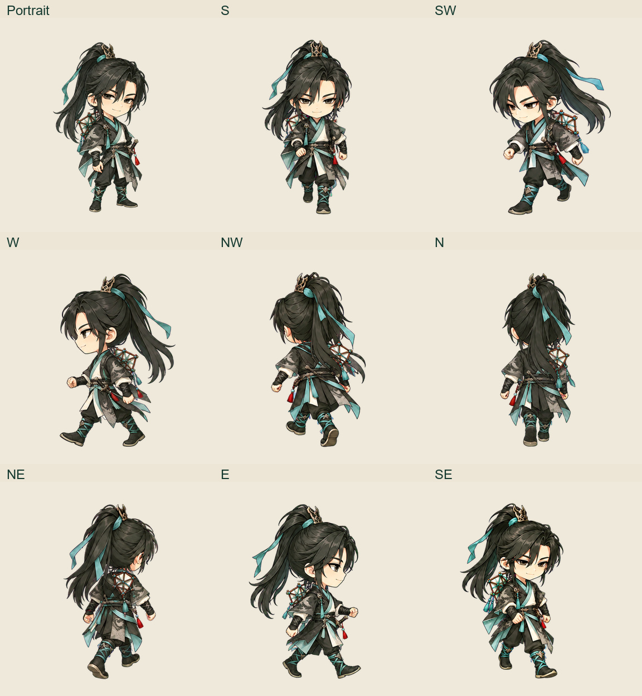

# 全文件夹风格复核：剩余素材修复

当前状态：已完成并写回原素材目录，2026-09-11 18:56 UTC 独立复核通过。本目录补齐全文件夹比较中最后确认的 04、14 号细边和 27 号墨鸢比例、步态问题。前一批正式 UI、旧主角移动帧、宠物、道具和引用副本见 [前一批交付](../qdao_cutout_edge_repair_20260910/README.md)。

## 04、14 号人物

4096 成品已清理连续紫边并写回原路径。保持全部 Alpha、区域外像素、正常紫色眼睛与流苏不变，保留白发暗线。两图及关联元数据均有发布前备份、源 SHA 校验和发布后校验。仓库内两张 1024 副本已同步，相关清单已更新；其余 20 张预备图未改，22 张预备图整体校验通过。

[实际发布记录](v9/published.json) · [1024 副本同步](v9/prepared-published.json) · [视觉复核](v9/review.json)

## 27 号墨鸢

旧版身体偏长，部分方向存在重复步态，因此重绘短身母图及八向原画。保留成年长脸、直发高马尾、墨色短袍、玉绿衣饰、鹤纹披肩、风筝和短刃。原画均由宿主内置 image_gen 生成；接口没有开放模型或质量参数，不把输出画布尺寸当作原生绘图细节。

整套 51 个媒体已通过逐方向目视和文件检查，并写回 `qdao_chibi_roster_v11/27_ink_kite_ranger/`：1 张立绘、八方向 32 张独立透明帧、8 条 strip、8 个四帧 GIF、2 张图集。单帧 512×512，脚点 (256, 471)，GIF 每帧 120 ms。西北、东北、东南缺失的相反姿势已补齐；东北曾出现头小身长的候选已淘汰，交付使用重新核对过的紧凑比例版本。

成品、原画、提示词和来源记录共发布 155 个文件；86 个原有文件均先完整备份，69 个文件新增，13 个未替换的历史文件保持不变。9 个处理输入来自 14 张实际原生图，其中 3 张输入为已验收原生帧的等比裁格排版；已从保存的原图逐像素重建验证。原生图与排版图在记录中分别标明。

[实际发布与备份](27/published.json) · [全部 51 媒体验收](27/staged-v2/processing/final-visual-approval.json) · [来源记录](27/generation-final.json)

[最终状态](current-status.json) · [处理与复现说明](27/tools/README.md) · [发布前正式目录基线](27/production-baseline.json)

## 最后核验

[独立最终核验](final-verification.json)重新读取了本轮 168 个发布文件及对应备份，全部 SHA 匹配。前一批 364 个文件也已复查，其中 211 张图片保持交付版本；共享 `assets_manifest.json` 的更新已追溯到本轮 04、14 号副本同步。并行任务修改的 6 份旧 27 号制作记录已备份并审查后合并，见 [基线变更记录](27/root-reviewed-baseline-transition.json)。

所有替换前的旧素材均保留可追溯备份。新的原画通过等比缩放、去底、切格与脚点对齐导出；不用人体压缩、镜像、复制帧来补造动作。本轮全文件夹比较已确认的素材修复至此完成；后续新增素材另按实际版本验收。此次只处理本仓库素材，客户端接入由对应任务管理。
