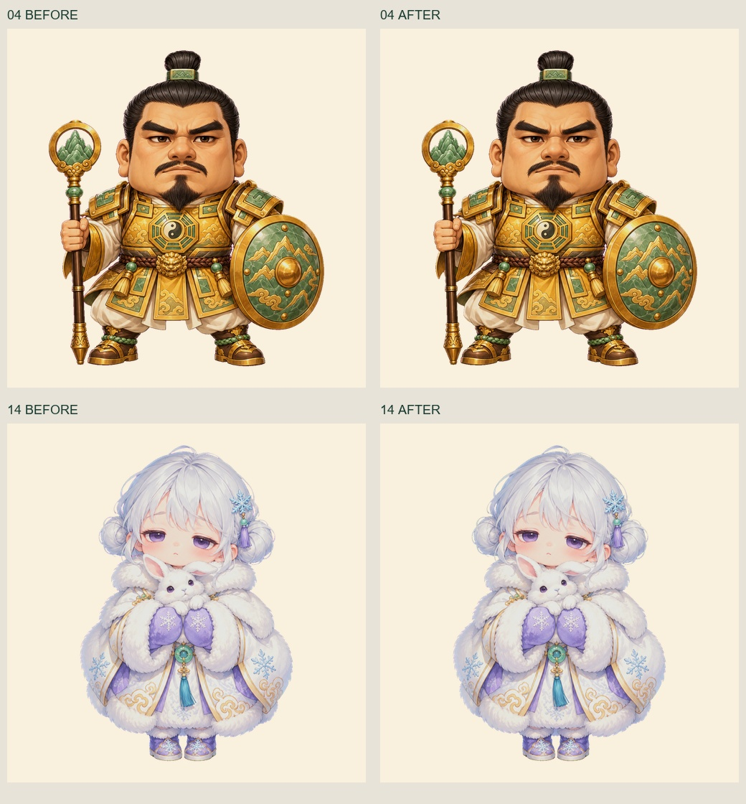

# v9 04 / 14 连续色边修复（已正式发布）

两张 4096 × 4096 RGBA 已完成视觉验收并原子写回正式路径。13 个原文件已备份至 backups/；22 张其他人物与历史生成、曝光和初次清边记录保持不变。

- 04：沿已确认甲缝、袖口及邻接金杖从顶环至底端清边，共 61,593 个 RGB 像素。
- 14：沿白发外轮廓、飞发环与两侧发髻完整清边，共 37,336 个 RGB 像素。
- 全部 Alpha、区域外像素、未选像素不变；正常紫眼睛和流苏设保护区并逐字节核对。
- 使用邻近正常前景色相并保留原明暗；7 张原生 2× 浅深底前后页及整体区域验收未见连续粉紫线，细暗描线、玉石和金色保留。

最终入口：`stage_expanded_edges.py`。`stage_local_edges.py` 为首轮局部方法留档，最终结果以 `review.json` 与 `staged/` 为准。`review-04-*`、`review-14-*` 为首轮证据；`expanded-review-*` 是最终验收页。

发布结果见 `published.json`。两张 4096 PNG、两张 1024 预备图与 9 个当前元数据文件已同步；双 manifest、24 张图片、22 条逐图记录、两张主角继承来源链、22 条视觉验收与 24 条兼容映射的 SHA 已核对一致。既有 `sync_prepared.py --check` 验证 22 张预备人物与当前源图逐像素一致；另 20 张预备人物未改。实际客户端和 Git 未操作。

