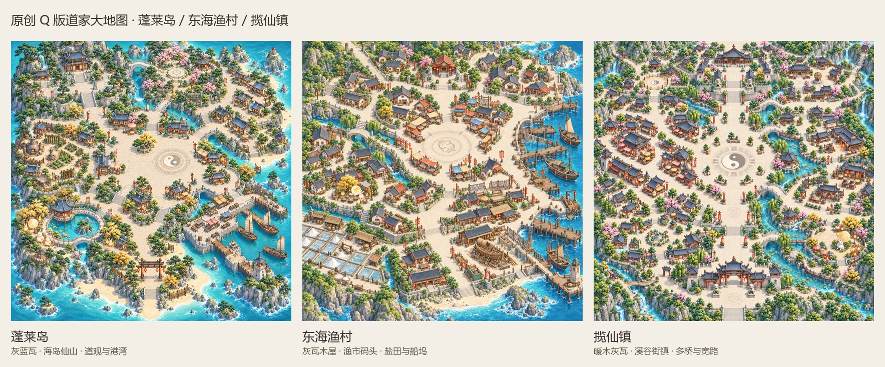

# 原创Q版道家大地图 · 2026-09-12

> 已新增 [春节、元宵灯会、中秋月夜三张氛围大地图](festival_variants/README.md)，加上原三张，目前共6张正式地图。

按用户所附天墉城大图的完整地图规模、俯视角度与小建筑比例制作。最终遵循最新纠正：不以青绿金色统一全图，采用适合各地的灰蓝瓦、木色、石路和海岸自然色。地形、街区、建筑布置重新设计；未使用《问道》的截图、地图、贴图或标志作为绘画输入。

| 地图 | 完整原图 | 原生像素 |
|---|---|---|
| 蓬莱岛 | [蓬莱岛](penglai_island/penglai-island-native.png) | 1254×1254 |
| 东海渔村 | [东海渔村](donghai_fishing_village/donghai-fishing-village-native.png) | 1254×1254 |
| 揽仙镇 | [揽仙镇](lanxian_town/lanxian-town-native.png) | 1254×1254 |

三张均保留工具真实原生像素，与用户指定参考的1254×1254尺寸相同；没有插值放大为6144再标作高清。画面按完整可探索区域绘制，宽路连接多个街区，点缀春节红灯笼、元宵花灯和中秋桂树月兔。根目录的原三张为三节元素综合日景版；新增的独立节庆氛围版本见festival_variants。

每张地图的目录内保存手写提示词、原始生成来源、实际尺寸和文件校验。揽仙镇的旧青绿金草稿放在draft-jade-gold，仅以lanxian-town-native.png作为最终版本。使用内置image_gen生成。

## 以前的大地图

[旧大地图索引](catalog/已有大地图索引.md) · [旧图对照预览](catalog/existing-large-maps-contact.jpg)

本地核实到5个以前的天墉城完整地图版本；有3个使用综合春节、元宵、中秋元素。检索范围内暂未找到旧蓬莱岛、东海渔村、揽仙镇，或分别按三个节日制作的氛围版本。没有重命名旧混合版以冒充这些版本。

## 游戏接入状态

这三张新地点目前完成地图美术与文件交付，尚未增加到游戏场景、传送、碰撞、导航。

用户转向本轮大地图制作前，旧天墉城与五张背景的客户端资源接入已保存：36块贴图、新寻路遮罩、灯柱前景、页面背景和战斗脚位。2026-09-12离线260个C#文件编译0错误；新的Unity实机验收、服务端导航烘焙及gate/scene重启尚未执行，当前运行中的客户端和服务端未被中断。新旧导航未完成同步前，不将其标为游戏接入完成。

此前主城美术已发布在image仓库分支art/festival-city-scenes-20260912，提交0aaed0685ae9e9362e72ae87e20726a7f35b723e；本轮三张新地点尚未提交或推送。
