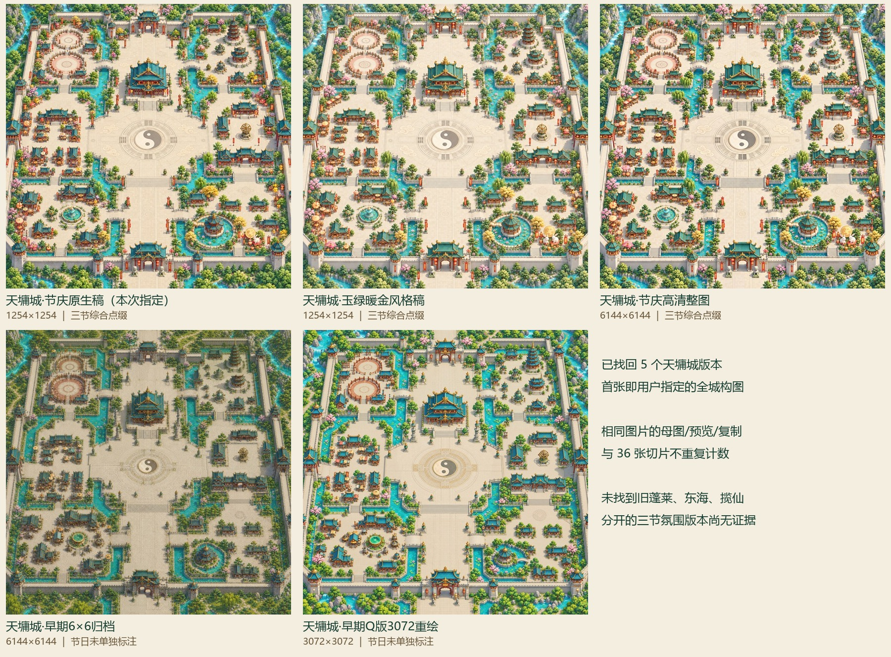

# 既有完整大城地图索引

核实5个既有天墉城地图版本；其中3个有综合春节/元宵/中秋装饰依据。未找到此前蓬莱岛/东海渔村/揽仙镇或分开的三节氛围大图文件证据；仅限上述本地范围。

本索引只整理旧文件，未改动原图。表中是完整地图版本数量，不把预览、复制、切片或单纯放大布局指南重复计算。文件修改时间不代表实际生成时间；逐文件尺寸、字节数、SHA-256 与 UTC 修改时间见 [index.json](index.json)。

| 地图版本 | 完整图尺寸 | 节日依据 | 原图 |
|---|---|---|---|
| 天墉城·节庆原生稿（本次指定） | 1254×1254 | 春节、元宵、中秋综合点缀 | [打开](<E:/work/image/tianyong_festival_gptimage2_20260910/tianyong-festival-main-city-native.png>) |
| 天墉城·玉绿暖金风格稿 | 1254×1254 | 春节、元宵、中秋综合点缀 | [打开](<E:/work/image/tianyong_festival_stylematch_20260910/tianyong-jade-gold-main-city-native.png>) |
| 天墉城·节庆高清整图 | 6144×6144 | 春节、元宵、中秋综合点缀 | [打开](<E:/work/image/tianyong_festival_hd_20260910/tianyong_city_master_6144.png>) |
| 天墉城·早期6×6归档 | 6144×6144 | 未单独标注 | [打开](<E:/work/image/tianyong_city_6x6/Previews/tianyong_city_master_6144.png>) |
| 天墉城·早期Q版3072重绘 | 3072×3072 | 未单独标注 | [打开](<E:/work/output/imagegen/qdao_city_v2_20260908/qdao_city_qstyle_master_3072.png>) |

## 尺寸与制作来源

- **天墉城·节庆原生稿（本次指定）**：原生1254×1254，无放大。 依据：[原目录记录](<E:/work/image/tianyong_festival_gptimage2_20260910/manifest.json>) 的 userDirection。
- **天墉城·玉绿暖金风格稿**：原生1254×1254，无放大。 依据：[原目录记录](<E:/work/image/tianyong_festival_stylematch_20260910/manifest.json>) 的 visualDirection。
- **天墉城·节庆高清整图**：36块独立1254图块裁接成6144×6144，成图未上采样；不是单次6144原生出图。 依据：[原目录记录](<E:/work/image/tianyong_festival_hd_20260910/manifest.json>) 的 sourceLayout.file / composition / finalArtUpscaled。
- **天墉城·早期6×6归档**：6144×6144客户端归档；来源1254×1254。尺寸不代表单次生成原生分辨率。 依据：[原目录记录](<E:/work/image/tianyong_city_6x6/PROMPTS.md>) 的 母图 / 单图精修。
- **天墉城·早期Q版3072重绘**：9块1254原生局部图拼接成3072×3072；保留完整城市布局。 依据：[原目录记录](<E:/work/output/imagegen/qdao_city_v2_20260908/manifest.json>) 的 sourceLayout / masterSize / sourcePatches / note。

## 检索范围与未发现项

已查看 `E:/work/image`、`E:/work/output/imagegen`、客户端 `Assets/Art`，读取地图清单及曝光调整备份映射，并只读查询 image 仓库所有现存分支历史的图像文件名。这里只能说明这些本地目录与历史中目前能核实的内容。

没有将横版主城/庭院背景、登录画面、战斗场景、人物、512/1024地图切片算成这种整城大地图。`qdao_large_city_maps_20260912` 中本轮新出的蓬莱岛、东海渔村、揽仙镇也不计为“以前已经生成”的旧图。

三个节庆天墉版本包含同图综合点缀，现有记录不支持把它们重命名为分别的春节版、元宵版或中秋版。
