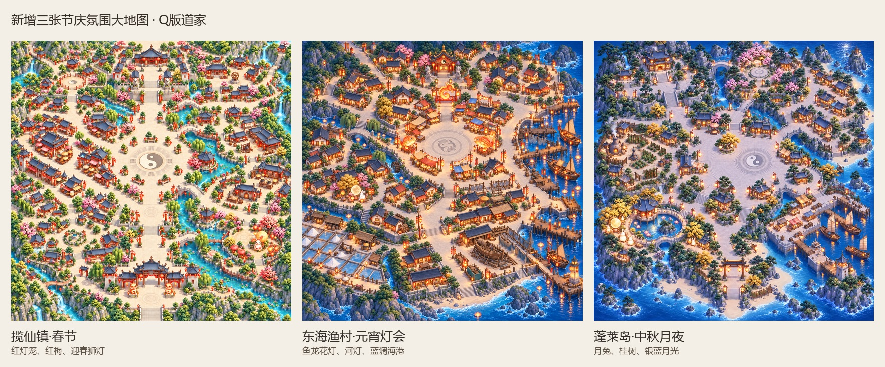

# 新增三张节庆氛围大地图

保留之前三张原创地图的完整区域、俯视比例、小建筑和宽路，再分别制作春节、元宵灯会和中秋月夜氛围。继续使用我们的Q版道家风格与各地自然配色，不强制青绿金。

| 地图 | 完整原图 | 氛围 |
|---|---|---|
| 揽仙镇·春节 | [打开原图](lanxian_spring_festival/map-native.png) | 红灯笼、红梅、迎春狮灯 |
| 东海渔村·元宵灯会 | [打开原图](donghai_lantern_festival/map-native.png) | 鱼龙花灯、河灯、蓝调海港 |
| 蓬莱岛·中秋月夜 | [打开原图](penglai_mid_autumn/map-native.png) | 月兔、桂树、银蓝月光 |

三张均为内置image_gen返回的原生1254×1254，未放大。同目录保留手写提示词、来源元数据和视觉审查记录，manifest.json记录文件哈希。原来的三张日景地图保留，因此本轮三个地点共有6张正式大地图。

[回到原三张地图](../README.md) · [此前天墉城大地图索引](../catalog/已有大地图索引.md)

这些新增文件是地图美术图，还未建立新的游戏场景、寻路、碰撞或传送。未修改客户端、服务端或操作提交推送。
