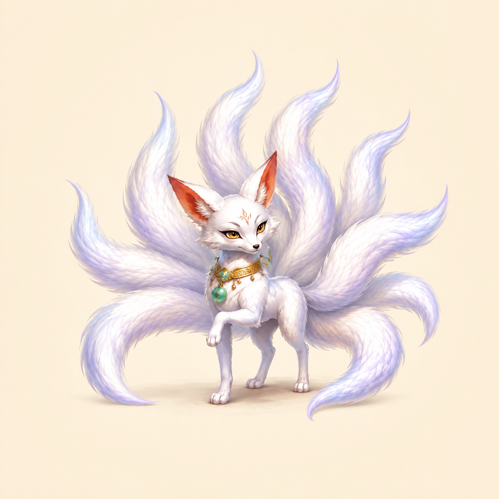

# 灵玥 · 九尾狐

《五行奇谈》的独立灵宠设定图与透明静态素材。名字取灵气与美玉之意，对应月白毛色、金玉项圈与淡紫尾影。

## 透明静态交付

[透明PNG](ling_yue_nine_tailed_fox-transparent_1254.png)为1254×1254真RGBA，保留九个尾尖、完整四肢、狐吻、金眼和金玉项圈。[完整提示词](ling_yue_nine_tailed_fox-transparent_1254.prompt.txt)与[生成及处理记录](../../qdao_asset_refresh_v6/pets/records/ling_yue.json)记录本次内置生图、真实尺寸和品红边清理。淡紫尾毛保留，原生画布没有放大。

[四宠物汇总与验收](../../qdao_asset_refresh_v6/pets/README.md)。原有暖米白概念图与记录保留；透明版另存，未制作动画或接入引擎。

## 形象

雪白细长狐脸、杏仁金眼、长粉耳、朱砂额纹、金玉项圈与细腿，前爪微抬。九条长尾舒展成扇，保持灵秀神宠气质，采用适度 Q 化的比例。延续新版[登录页](../source/01_login.png)及[选服页](../source/02_server_select.png)中的狐狸方向。

## 文件与复现

- [最终图片](ling_yue_nine_tailed_fox.png)：内置图像生成工具最终输出，原生 1254×1254 RGB。
- [初始完整提示词](ling_yue_nine_tailed_fox.prompt.txt)。
- [修正提示词](ling_yue_nine_tailed_fox.revision.prompt.txt)：一次尾数与留白修正的完整提示词。
- [manifest.json](manifest.json)：来源、参考路径、实际尺寸、文件校验值与检查记录。

重新生成时，先查看并提供两张 UI 参考图，再使用初始提示词。修正提示词针对首版多出一条尾巴的局部问题；只有新输出出现相同问题时才适用，不应无条件重复删除尾巴。生成结果并非确定性输出，需要重新目视核对尾数。

## 检查与交付范围

最终图目视可数 **9 个独立尾尖**；全身、耳尖、四肢和尾尖完整，无裁切。主体与四边均有约 8% 以上余白。尾根在身后有自然遮挡，尾数按九个清晰分离的外轮廓尖端核对。

上方原设定图是暖米白背景的单张概念图；本轮透明版另见前述交付。两者均为静态素材，未制作动画序列或接入引擎。名字保存在文档中，没有烘焙进画面。
